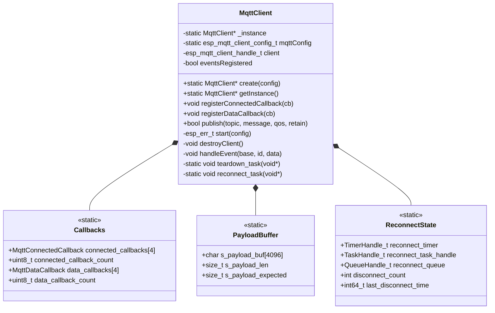

# ED_MQTT Library Documentation

## Overview

`ED_MQTT` is a lightweight, **thread‑safe** MQTT client for ESP‑IDF (ESP32) that **never performs dynamic memory allocation** after boot. It is designed for indefinite runtime without heap fragmentation.

- Based on ESP‑IDF’s `esp-mqtt` with MQTT 5.0 support.
- TLS 1.2 secured using `esp_crt_bundle_attach` (no per‑device certificates).
- **No `malloc` / `new`** after initialisation – all buffers and callback tables are static.
- **Fully thread‑safe** using a statically allocated recursive mutex.
- Provides a singleton `MqttClient` with static payload reassembly, eliminating `std::string` fragmentation.

---

## Features

| Feature                     | Implementation |
|-----------------------------|----------------|
| MQTT 5.0 protocol           | Enabled via `CONFIG_MQTT_PROTOCOL_5` |
| TLS certificate verification | `esp_crt_bundle_attach` (bundle of public CAs) |
| Last Will & Testament (LWT) | Configured with `retain=true`, QOS1 |
| Connection recovery         | Automatic teardown+rebuild on prolonged disconnect |
| Heap fragmentation prevention | Static payload buffer (4 KB), fixed callback arrays |
| Thread safety               | Recursive mutex (static memory) protects all shared data |
| mDNS hostname resolution    | Falls back to `<host>.local` automatically |

---

## Logical Structure (Mermaid)



### Component Description

- **MqttClient** – Main singleton class. Manages the underlying `esp_mqtt_client_handle_t`, event handling, and lifecycle.
- **Callbacks** – Two static arrays storing user function pointers. Fixed size (max 4 each) – no heap.
- **PayloadBuffer** – Static 4KB buffer used to reassemble multi‑fragment MQTT messages. Replaces `std::string` which caused fragmentation.
- **ReconnectState** – Timer, task handle, queue, and counters for intelligent reconnect logic (short vs. long outages).

---

## Thread Safety Model

All shared resources are protected by a **recursive mutex** created statically (`StaticSemaphore_t`). The mutex is initialised before `app_main()`.

Protected resources:
- `client` handle
- `s_payload_buf`, `s_payload_len`, `s_payload_expected`
- `connected_callbacks[]` and `connected_callback_count`
- `data_callbacks[]` and `data_callback_count`
- `disconnect_count`, `last_disconnect_time`

Because the mutex is **recursive**, a callback registered with `registerDataCallback` can safely call `publish()` or `registerConnectedCallback()` without deadlock.

---

## Usage Example

### 1. Include headers

```cpp
#include "ED_mqtt.h"
#include "secrets.h"   // defines ED_MQTT_USERNAME, ED_MQTT_PASSWORD
```

### 2. Define callbacks (optional)

```cpp
void on_mqtt_connected(esp_mqtt_client_handle_t client) {
    ESP_LOGI("APP", "MQTT connected, subscribing to sensor topic");
    esp_mqtt_client_subscribe(client, "sensors/temperature", 1);
}

void on_mqtt_data(esp_mqtt_client_handle_t client,
                  const char* topic, int topic_len,
                  const char* data, size_t data_len,
                  int64_t msgID) {
    ESP_LOGI("APP", "Received %.*s: %.*s", topic_len, topic, data_len, data);
}
```

### 3. Create and start MQTT client (after WiFi is ready)

```cpp
// Usually inside a WiFi “IP ready” callback
void wifi_ready() {
    auto* mqtt = ED_MQTT::MqttClient::create();   // uses default config from secrets.h
    if (mqtt) {
        mqtt->registerConnectedCallback(on_mqtt_connected);
        mqtt->registerDataCallback(on_mqtt_data);
    }
}
```

### 4. Publish a message

```cpp
auto* mqtt = ED_MQTT::MqttClient::getInstance();
if (mqtt) {
    mqtt->publish("devices/status", "online", 1, true);
}
```

### 5. Custom configuration (instead of default)

```cpp
esp_mqtt_client_config_t cfg = {};
cfg.broker.address.uri = "mqtts://mybroker.local:8883";
cfg.credentials.username = "device1";
cfg.credentials.authentication.password = "secret";
// ... other fields
auto* mqtt = ED_MQTT::MqttClient::create(&cfg);
```

### 6. Using the sample derived class (reference)

```cpp
esp_mqtt_client_config_t cfg = {};
ED_MQTT::SAMPLE_derivedMqttClient::create(cfg);
auto* derived = ED_MQTT::SAMPLE_derivedMqttClient::getInstance();
derived->send_ping_message("ping");
```

---

## API Reference

### `MqttClient::create()`

```cpp
static MqttClient* create(esp_mqtt_client_config_t* config = nullptr);
```

Creates the singleton instance (if not already created) and starts the MQTT client.
If `config` is `nullptr`, the built‑in default configuration is used (see `setDefaultConfig()`).
Returns the instance pointer, or `nullptr` on failure.

### `MqttClient::getInstance()`

```cpp
static MqttClient* getInstance();
```

Returns the singleton instance, or `nullptr` if `create()` has not been called.

### `registerConnectedCallback()`

```cpp
void registerConnectedCallback(MqttConnectedCallback callback);
```

Registers a function to be called whenever the MQTT broker connection is established.
Maximum 4 callbacks. The callback signature:

```cpp
void (*)(esp_mqtt_client_handle_t client);
```

### `registerDataCallback()`

```cpp
void registerDataCallback(MqttDataCallback callback);
```

Registers a function to be called for every fully reassembled incoming MQTT message.
Maximum 4 callbacks. The callback signature:

```cpp
void (*)(esp_mqtt_client_handle_t client,
         const char* topic, int topicLen,
         const char* data, size_t dataLen,
         int64_t msgID);
```

**Note:** `topic` is **not** null‑terminated – use `topicLen`.
`data` points into the static reassembly buffer and is valid **only during the callback** – copy it if needed later.

### `publish()`

```cpp
bool publish(const char* topic, const char* message, int qos = 1, bool retain = false);
```

Publishes a message to the MQTT broker. Returns `true` on success, `false` on error (e.g., client not connected).
The method is thread‑safe and uses the recursive mutex.

### `getHandle()`

```cpp
esp_mqtt_client_handle_t getHandle();
```

Returns the underlying `esp_mqtt_client_handle_t` for advanced operations (e.g., manual subscribe).

---

## Configuration Defaults

The default configuration (used when `create(nullptr)` is called) is defined in `MqttClient::setDefaultConfig()`:

| Parameter                | Value |
|--------------------------|-------|
| Broker URI               | `mqtts://192.168.1.220:8883` |
| CA verification          | `esp_crt_bundle_attach` (system CA bundle) |
| Username / Password      | From `secrets.h` (`ED_MQTT_USERNAME`, `ED_MQTT_PASSWORD`) |
| Client ID                | `ED_SYS::ESP_std::Device::mqttName()` |
| Last Will topic          | `devices/connection/<client_id>` |
| Last Will message        | `<client_id> disconnected unexpectedly.` |
| LWT QoS / Retain         | QOS1 / `true` |
| Protocol version         | MQTT 5.0 |

To use a different broker or credentials, pass your own `esp_mqtt_client_config_t` to `create()`.

---

## Important Notes

### 1. Heap allocation – only at boot
- The single `MqttClient` instance is allocated with `new` in `create()`. This is **the only** heap allocation in the library.
- No further allocations happen during runtime: no `std::string`, no `std::function`, no dynamic containers.

### 2. Payload size limit
Maximum reassembled MQTT payload is `MAX_MQTT_PAYLOAD` (default 4096 bytes). Larger messages are logged and dropped.

### 3. Callback maximums
- Connected callbacks: max 4
- Data callbacks: max 4
These limits are compile‑time constants and can be increased by editing the header.

### 4. Thread safety requirements
The library uses a **recursive mutex**. You can call any public method from any FreeRTOS task, including from inside a callback. However, avoid holding the mutex for long periods (e.g., slow I/O inside a data callback) – it will block other tasks from using MQTT.

### 5. DNS / mDNS resolution
`resolve_uri_with_fallback()` is called automatically when starting the client. If the hostname does not resolve directly, it appends `.local` and retries (for mDNS). This function blocks until resolution completes – ensure WiFi has an IP address before calling `create()`.

### 6. Reconnect behaviour
- **Short outage** (frequent short disconnects, <60s between them): the library lets the underlying MQTT stack auto‑reconnect.
- **Prolonged outage** (disconnects spaced >60s, or 3+ short disconnects): the client is fully destroyed and rebuilt, which cleans up stale TCP/TLS state.

### 7. Teardown and reconnect tasks
Two internal FreeRTOS tasks are created:
- `mqtt_teardown` – destroys the client from a safe context (avoids recursive event loop issues).
- `mqtt_reconnect` – waits on a queue and restarts the client after a delay.

Both are created only once and never deleted.

---

## Building and Dependencies

- ESP‑IDF v5.5 or later
- Component `ED_SYS` (provides `ED_SYS::ESP_std::Device::mqttName()`)
- Component `ED_wifi` (optional, but recommended to wait for IP before creating MQTT)
- Header `secrets.h` must define:
  ```cpp
  #define ED_MQTT_USERNAME "your_username"
  #define ED_MQTT_PASSWORD "your_password"
  ```
- Set `CONFIG_MQTT_PROTOCOL_5=y` in `sdkconfig` to enable MQTT 5.0 features.

---

## Troubleshooting

| Symptom | Likely cause | Solution |
|---------|--------------|----------|
| `assert failed: xQueueTakeMutexRecursive` | Mutex not initialised before use | Ensure you are using the corrected code where `init_mqtt_mutex()` runs at global scope. |
| Payload incomplete / corrupted | Multiple `MQTT_EVENT_DATA` fragments not reassembled correctly | Check that the static buffer is protected by the mutex (it is in the provided code). |
| Heap fragmentation increases slowly | Some component still uses dynamic allocation | Verify that `ESP_LOGD` logs do not allocate; disable `DEBUG_BUILD` if needed. |
| MQTT fails to connect with `-1` | DNS resolution blocks or fails | Call `create()` only after WiFi IP is obtained – subscribe to `ED_wifi` “IP ready” event. |
| Repeated reconnects every few seconds | Short outage detection threshold too low | Adjust `MAX_DISCONNECTS` or `SHORT_WINDOW_SEC` in `isShortOutage()`. |

---

## File List

| File | Description |
|------|-------------|
| `ED_mqtt.h` | Public API, callback types, class declaration |
| `ED_mqtt.cpp` | Implementation with static mutex, payload buffer, reconnect logic |
| `secrets.h` (user provided) | Username and password for MQTT broker |

---

## License

Same as the parent project (proprietary / internal). Adjust as needed.

---

*Documentation version 1.0 – for ED_MQTT component*
```