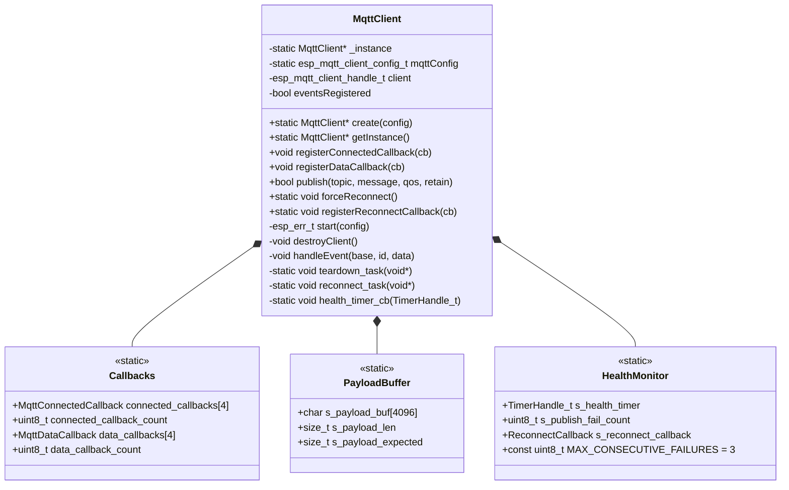

# ED_MQTT Library Documentation

## Overview

`ED_MQTT` is a lightweight, **thread‑safe** MQTT client for ESP‑IDF (ESP32) that **never performs dynamic memory allocation** after boot. It is designed for indefinite runtime without heap fragmentation.

- Based on ESP‑IDF’s `esp-mqtt` with MQTT 5.0 support.
- TLS 1.2 secured using `esp_crt_bundle_attach` (no per‑device certificates).
- **No `malloc` / `new`** after initialisation – all buffers and callback tables are static.
- **Fully thread‑safe** using a statically allocated recursive mutex.
- **Automatic recovery** – detects publish failures and reconnects transparently.
- Provides a singleton `MqttClient` with static payload reassembly, eliminating `std::string` fragmentation.

---

## Features

| Feature                     | Implementation |
|-----------------------------|----------------|
| MQTT 5.0 protocol           | Enabled via `CONFIG_MQTT_PROTOCOL_5` |
| TLS certificate verification | `esp_crt_bundle_attach` (bundle of public CAs) |
| Last Will & Testament (LWT) | Configured with `retain=true`, QOS1 |
| Connection recovery         | Automatic teardown+rebuild on prolonged disconnect |
| **Publish failure detection** | Counts consecutive publish errors; reconnects after `MAX_CONSECUTIVE_FAILURES` (default 3) |
| **Health monitor timer**    | Periodically checks publish failure counter; triggers reconnect if threshold exceeded |
| **Forced reconnect API**    | `forceReconnect()` – safe to call from any task |
| **Reconnect callback**      | Optional notification when library forces a reconnect |
| Heap fragmentation prevention | Static payload buffer (4 KB), fixed callback arrays |
| Thread safety               | Recursive mutex (static memory) protects all shared data |
| mDNS hostname resolution    | Falls back to `<host>.local` automatically |

---

## Logical Structure (Mermaid)



### Component Description

- **MqttClient** – Main singleton class. Manages the underlying `esp_mqtt_client_handle_t`, event handling, and lifecycle.
- **Callbacks** – Two static arrays storing user function pointers. Fixed size (max 4 each) – no heap.
- **PayloadBuffer** – Static 4KB buffer used to reassemble multi‑fragment MQTT messages. Replaces `std::string` which caused fragmentation.
- **HealthMonitor** – Periodic timer (30 sec) that checks `s_publish_fail_count`. If ≥3 consecutive publish failures, calls `forceReconnect()` and optionally invokes user callback.

---

## Thread Safety Model

All shared resources are protected by a **recursive mutex** created statically (`StaticSemaphore_t`). The mutex is lazily initialised on first use (after FreeRTOS scheduler starts).

Protected resources:
- `client` handle
- `s_payload_buf`, `s_payload_len`, `s_payload_expected`
- `connected_callbacks[]` and `connected_callback_count`
- `data_callbacks[]` and `data_callback_count`
- `disconnect_count`, `last_disconnect_time`
- Health monitor counters

Because the mutex is **recursive**, a callback registered with `registerDataCallback` can safely call `publish()` or `registerConnectedCallback()` without deadlock.

---

## Automatic Reconnection Logic

The library **monitors publish failures internally** – no application code needed.

- Every call to `publish()` that returns an error (e.g., `esp_mqtt_client_publish` returns <0) increments a static counter `s_publish_fail_count`.
- A successful publish resets the counter to 0.
- A **health timer** (period = 30 s) checks the counter. If `s_publish_fail_count >= MAX_CONSECUTIVE_FAILURES` (default 3), it calls `forceReconnect()`.
- `forceReconnect()` stops the current MQTT client, notifies the teardown task, and schedules a reconnect after 1 s.
- After reconnection, the client resumes normal operation.

This mechanism **does not** use an idle timeout – reconnects only happen when publish operations actually fail.

---

## Usage Example

### 1. Include headers

```cpp
#include "ED_mqtt.h"
#include "secrets.h"   // defines ED_MQTT_USERNAME, ED_MQTT_PASSWORD
```

### 2. Define callbacks (optional)

```cpp
void on_mqtt_connected(esp_mqtt_client_handle_t client) {
    ESP_LOGI("APP", "MQTT connected, subscribing to sensor topic");
    esp_mqtt_client_subscribe(client, "sensors/temperature", 1);
}

void on_mqtt_data(esp_mqtt_client_handle_t client,
                  const char* topic, int topic_len,
                  const char* data, size_t data_len,
                  int64_t msgID) {
    ESP_LOGI("APP", "Received %.*s: %.*s", topic_len, topic, data_len, data);
}

void on_mqtt_reconnected() {
    ESP_LOGI("APP", "MQTT auto-reconnected by library");
    // Re-subscribe if needed
}
```

### 3. Create and start MQTT client (after WiFi is ready)

```cpp
// Usually inside a WiFi "IP ready" callback
void wifi_ready() {
    auto* mqtt = ED_MQTT::MqttClient::create();   // uses default config from secrets.h
    if (mqtt) {
        mqtt->registerConnectedCallback(on_mqtt_connected);
        mqtt->registerDataCallback(on_mqtt_data);
        MqttClient::registerReconnectCallback(on_mqtt_reconnected); // optional
    }
}
```

### 4. Publish a message

```cpp
auto* mqtt = ED_MQTT::MqttClient::getInstance();
if (mqtt) {
    bool ok = mqtt->publish("devices/status", "online", 1, true);
    if (!ok) {
        // Library will automatically count the failure and may reconnect later.
        // No action required here.
    }
}
```

### 5. Custom configuration (instead of default)

```cpp
esp_mqtt_client_config_t cfg = {};
cfg.broker.address.uri = "mqtts://mybroker.local:8883";
cfg.credentials.username = "device1";
cfg.credentials.authentication.password = "secret";
// ... other fields
auto* mqtt = ED_MQTT::MqttClient::create(&cfg);
```

### 6. Force reconnect manually (if needed)

```cpp
MqttClient::forceReconnect();
```

---

## API Reference

### `MqttClient::create()`

```cpp
static MqttClient* create(esp_mqtt_client_config_t* config = nullptr);
```

Creates the singleton instance (if not already created) and starts the MQTT client.
If `config` is `nullptr`, the built‑in default configuration is used.
Returns the instance pointer, or `nullptr` on failure.

### `MqttClient::getInstance()`

```cpp
static MqttClient* getInstance();
```

Returns the singleton instance, or `nullptr` if `create()` has not been called.

### `registerConnectedCallback()`

```cpp
void registerConnectedCallback(MqttConnectedCallback callback);
```

Registers a function to be called whenever the MQTT broker connection is established.
Maximum 4 callbacks. Signature:

```cpp
void (*)(esp_mqtt_client_handle_t client);
```

### `registerDataCallback()`

```cpp
void registerDataCallback(MqttDataCallback callback);
```

Registers a function for every fully reassembled incoming MQTT message.
Max 4 callbacks. Signature:

```cpp
void (*)(esp_mqtt_client_handle_t client,
         const char* topic, int topicLen,
         const char* data, size_t dataLen,
         int64_t msgID);
```

**Note:** `topic` is not null‑terminated – use `topicLen`.
`data` points into a static buffer, valid only during the callback – copy it if needed later.

### `publish()`

```cpp
bool publish(const char* topic, const char* message, int qos = 1, bool retain = false);
```

Publishes a message. Returns `true` on success, `false` on error.
**Automatic failure counting**: each failure increments an internal counter; a successful publish resets it. The health monitor triggers reconnect after 3 consecutive failures.

### `forceReconnect()`

```cpp
static void forceReconnect();
```

Immediately tears down the current MQTT client and schedules a reconnect after 1 second. Safe to call from any task. Used internally by the health monitor; can also be called by user code.

### `registerReconnectCallback()`

```cpp
using ReconnectCallback = void (*)(void);
static void registerReconnectCallback(ReconnectCallback cb);
```

Registers a function that will be called **when the library forces a reconnect** (i.e., after 3 consecutive publish failures). Optional – can be used to re‑subscribe to topics or log the event.

### `getHandle()`

```cpp
esp_mqtt_client_handle_t getHandle();
```

Returns the underlying `esp_mqtt_client_handle_t` for advanced operations (e.g., manual subscribe).

---

## Configuration Defaults

The default configuration (used when `create(nullptr)` is called) is defined in `MqttClient::setDefaultConfig()`:

| Parameter                | Value |
|--------------------------|-------|
| Broker URI               | `mqtts://192.168.1.220:8883` |
| CA verification          | `esp_crt_bundle_attach` (system CA bundle) |
| Username / Password      | From `secrets.h` (`ED_MQTT_USERNAME`, `ED_MQTT_PASSWORD`) |
| Client ID                | `ED_SYS::ESP_std::Device::mqttName()` |
| Last Will topic          | `devices/connection/<client_id>` |
| Last Will message        | `<client_id> disconnected unexpectedly.` |
| LWT QoS / Retain         | QOS1 / `true` |
| Protocol version         | MQTT 5.0 |

### Health monitor constants (compile‑time)

| Constant | Default | Description |
|----------|---------|-------------|
| `MAX_CONSECUTIVE_FAILURES` | 3 | Number of publish failures before forcing reconnect |
| `HEALTH_CHECK_PERIOD_MS` | 30000 ms | Timer interval to check failure counter |

These can be adjusted by modifying the class constants in `ED_mqtt.h`.

---

## Important Notes

### 1. Heap allocation – only at boot
- The single `MqttClient` instance is allocated with `new` in `create()`. This is **the only** heap allocation.
- No runtime allocations: no `std::string`, no `std::function`, no dynamic containers.

### 2. Payload size limit
Maximum reassembled MQTT payload is `MAX_MQTT_PAYLOAD` (default 4096 bytes). Larger messages are dropped.

### 3. Callback maximums
- Connected callbacks: max 4
- Data callbacks: max 4
These limits are compile‑time constants.

### 4. Thread safety
The library uses a **recursive mutex**. You can call any public method from any FreeRTOS task, including from inside a callback. Avoid long critical sections.

### 5. Automatic reconnect behaviour
- On **publish failure**: library increments counter. After 3 consecutive failures, it forces a rebuild of the client.
- On **MQTT disconnect events**: existing `isShortOutage()` logic decides whether to rebuild (long outage) or let auto‑reconnect handle it.
- On **transport errors**: same as prolonged disconnect → rebuild.

### 6. mDNS / DNS resolution
`resolve_uri_with_fallback()` is called automatically. If hostname does not resolve, it appends `.local` (mDNS) and retries. Call `create()` only after WiFi IP is obtained.

---

## Troubleshooting

| Symptom | Likely cause | Solution |
|---------|--------------|----------|
| `undefined reference to mqtt_reconnect_timer` | Static timer not defined in `.cpp` | Add `TimerHandle_t MqttClient::mqtt_reconnect_timer = nullptr;` in `.cpp` |
| `identifier "ReconnectCallback" is undefined` | Missing scope resolution | Use `MqttClient::ReconnectCallback` inside `.cpp` |
| No automatic reconnect on publish failures | Health timer not started | Check `setInstance()` starts the timer; ensure `MAX_CONSECUTIVE_FAILURES` not too large |
| `forceReconnect()` has no effect | Teardown task not created | Verify `teardown_task_handle` is set in `setInstance()` |
| Payload incomplete | Multi‑fragment message not reassembled | Static buffer is protected by mutex – should work; enable `ESP_LOGV` for MQTT events |
| Heap fragmentation slowly increases | Some component still allocates | Disable `DEBUG_BUILD`; check third‑party libraries |

---

## File List

| File | Description |
|------|-------------|
| `ED_mqtt.h` | Public API, callback types, class declaration |
| `ED_mqtt.cpp` | Implementation with static mutex, payload buffer, health monitor, reconnect logic |
| `secrets.h` (user provided) | Username and password for MQTT broker |

---

## License

Same as the parent project (proprietary / internal). Adjust as needed.

---

*Documentation version 2.0 – for ED_MQTT component with auto‑reconnect on publish failures*
```