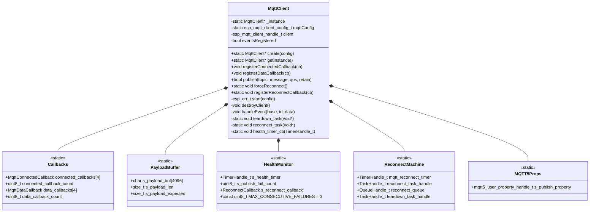

# ED_MQTT Library Documentation

## Overview

`ED_MQTT` is a lightweight, **thread‑safe** MQTT client for ESP‑IDF (ESP32) that **never performs dynamic memory allocation** after boot. It is designed for indefinite runtime without heap fragmentation.

- Based on ESP‑IDF’s `esp-mqtt` with MQTT 5.0 support.
- TLS 1.2 secured using `esp_crt_bundle_attach` (no per‑device certificates).
- **No `malloc` / `new`** after initialisation – all buffers and callback tables are static.
- **Fully thread‑safe** using a statically allocated non‑recursive mutex.
- **Automatic recovery** – detects publish failures and reconnects transparently.
- **MQTT5 user property** – automatically adds `client-id` to every publish for debugging.
- Provides a singleton `MqttClient` with static payload reassembly, eliminating `std::string` fragmentation.

---

## Features

| Feature                     | Implementation |
|-----------------------------|----------------|
| MQTT 5.0 protocol           | Enabled via `CONFIG_MQTT_PROTOCOL_5` |
| TLS certificate verification | `esp_crt_bundle_attach` (bundle of public CAs) |
| Last Will & Testament (LWT) | Configured with `retain=true`, QOS1 |
| Connection recovery         | Automatic teardown+rebuild on prolonged disconnect or publish failures |
| **Publish failure detection** | Counts consecutive publish errors; reconnects after `MAX_CONSECUTIVE_FAILURES` (default 3) |
| **Health monitor timer**    | Periodically checks publish failure counter; triggers `forceReconnect()` if threshold exceeded |
| **Forced reconnect API**    | `forceReconnect()` – safe to call from any task |
| **Reconnect callback**      | Optional notification when library forces a reconnect |
| **MQTT5 user property**     | `client-id` automatically added to every publish message (for device identification) |
| Heap fragmentation prevention | Static payload buffer (4 KB), fixed callback arrays |
| Thread safety               | Non‑recursive mutex (static memory) protects all shared data; careful lock ordering prevents deadlocks |
| mDNS hostname resolution    | Falls back to `<host>.local` automatically |

---

## Important: TLS Certificate Name Matching

When using TLS (`mqtts://`), the **broker URI hostname must exactly match** the Common Name (CN) or a Subject Alternative Name (SAN) present in the server’s certificate. If your certificate is issued for `raspi00`, you **must** use `mqtts://raspi00:8883`. Using an IP address (`192.168.1.220`) will cause a TLS certificate name mismatch and the connection will fail.

The default broker URI shown in `setDefaultConfig()` (`mqtts://192.168.1.220:8883`) is just a **placeholder example**; do not use it unless your certificate is valid for that IP. Always override the configuration with your own URI that matches your certificate.

Example of correct configuration for a certificate with CN `raspi00`:

```cpp
esp_mqtt_client_config_t mqtt_cfg = {};
mqtt_cfg.broker.address.uri = "mqtts://raspi00:8883";
// ... other settings
MqttClient::create(&mqtt_cfg);
```

---

## Logical Structure (Mermaid)



### Component Description

- **MqttClient** – Main singleton class. Manages the underlying `esp_mqtt_client_handle_t`, event handling, and lifecycle.
- **Callbacks** – Two static arrays storing user function pointers. Fixed size (max 4 each) – no heap.
- **PayloadBuffer** – Static 4KB buffer used to reassemble multi‑fragment MQTT messages. Replaces `std::string` which caused fragmentation.
- **HealthMonitor** – Periodic timer (30 sec) that checks `s_publish_fail_count`. If ≥3 consecutive publish failures, calls `forceReconnect()` and optionally invokes user callback.
- **ReconnectMachine** – Manages teardown task, reconnect task, and a timer to orchestrate reconnection after a disconnection or failure. Ensures that the MQTT client is destroyed safely before being recreated.
- **MQTT5Props** – Holds a user property handle that adds a `client-id` property to every outgoing publish message. The value is the device's MQTT client ID (as set in the configuration). This allows the broker to identify the source of each message.

---

## Thread Safety Model

All shared resources are protected by a **non‑recursive mutex** created statically (`StaticSemaphore_t`). The mutex is lazily initialised on first use (after FreeRTOS scheduler starts).

Protected resources:
- `client` handle
- `s_payload_buf`, `s_payload_len`, `s_payload_expected`
- `connected_callbacks[]` and `connected_callback_count`
- `data_callbacks[]` and `data_callback_count`
- `disconnect_count`, `last_disconnect_time`
- Health monitor counters
- MQTT5 property handle (read/update)

Important locking rules:
- The mutex is **non‑recursive** – it cannot be taken twice by the same task. All code paths are carefully designed to avoid nested locking.
- `destroyClient()` must be called with the mutex already held.
- `start()` must be called with the mutex already held.
- The teardown task releases the mutex **before** destroying the underlying MQTT client to avoid deadlocks during event callbacks.
- `reconnect_task` uses a 2‑second timeout when taking the mutex to prevent blocking forever.

---

## Automatic Reconnection Logic

The library monitors both **disconnection events** and **publish failures** internally – no application code needed.

### Publish failure detection
- Every call to `publish()` that returns an error increments a static counter `s_publish_fail_count`.
- A successful publish resets the counter to 0.
- A **health timer** (period = 30 s) checks the counter. If `s_publish_fail_count >= MAX_CONSECUTIVE_FAILURES` (default 3), it calls `forceReconnect()`.

### Disconnection handling
- When `MQTT_EVENT_DISCONNECTED` or a transport error occurs, the library evaluates `isShortOutage()`.
- If the disconnect is considered **prolonged** (after 3 disconnects within 60 seconds), it schedules a teardown and rebuild.
- Otherwise, the underlying `esp-mqtt` stack is allowed to autoreconnect automatically.

### Teardown and rebuild process
1. `forceReconnect()` (or the event handler) notifies the `teardown_task`.
2. The teardown task takes the mutex, copies the client handle, clears the pointer, releases the mutex, then stops and destroys the client.
3. A timer (`mqtt_reconnect_timer`) is started with a short delay (1000 ms for manual force, 3000 ms for disconnects, 5000 ms for transport errors).
4. When the timer expires, a signal is sent to the `reconnect_task` queue.
5. `reconnect_task` takes the mutex, destroys any remaining client (just in case), and calls `start()` to re‑initialise the MQTT client.
6. After successful `start()`, the connection is re‑established and normal operation resumes.

This mechanism does **not** use an idle timeout – reconnects only happen when publish operations actually fail or when a genuine disconnect/error occurs.

---

## MQTT5 User Property: `client-id`

When MQTT5 is enabled (`CONFIG_MQTT_PROTOCOL_5=y`), the library **automatically** attaches a user property `client-id` to every outgoing publish message. The value is the client ID of the device (as configured in `mqttConfig.credentials.client_id`). This is extremely useful for debugging on the broker side – you can see exactly which device sent a message, even if you are not subscribed to the `$SYS` topics.

**How it works:**
- At client initialisation, a user property handle is created once.
- Before each `publish()`, the handle is attached to the publish packet using `esp_mqtt5_client_set_publish_property()`.
- The broker (or any subscriber that inspects user properties) will see a property with key `client-id` and the device’s client ID as the value.

**Example (MQTT subscriber with verbose output – Mosquitto):**

```text
Client mosq-sub received PUBLISH (d0, q1, r0, m1, 'sensors/temp', ... (10 bytes), client-id=ESP_32_97_54)
```

**No action is required from your application** – this is completely transparent.

---

## Usage Example

### 1. Include headers

```cpp
#include "ED_mqtt.h"
#include "secrets.h"   // defines ED_MQTT_USERNAME, ED_MQTT_PASSWORD
```

### 2. Define callbacks (optional)

```cpp
void on_mqtt_connected(esp_mqtt_client_handle_t client) {
    ESP_LOGI("APP", "MQTT connected, subscribing to sensor topic");
    esp_mqtt_client_subscribe(client, "sensors/temperature", 1);
}

void on_mqtt_data(esp_mqtt_client_handle_t client,
                  const char* topic, int topic_len,
                  const char* data, size_t data_len,
                  int64_t msgID) {
    ESP_LOGI("APP", "Received %.*s: %.*s", topic_len, topic, data_len, data);
}

void on_mqtt_reconnected() {
    ESP_LOGI("APP", "MQTT auto-reconnected by library");
    // Re-subscribe if needed
}
```

### 3. Create and start MQTT client (after WiFi is ready)

**Important:** The broker URI **must** match the certificate’s CN/SAN. Example for a certificate valid for `raspi00`:

```cpp
void wifi_ready() {
    // Create a configuration with the correct hostname
    esp_mqtt_client_config_t mqtt_cfg = {};
    mqtt_cfg.broker.address.uri = "mqtts://raspi00:8883";
    mqtt_cfg.credentials.username = ED_MQTT_USERNAME;
    mqtt_cfg.credentials.authentication.password = ED_MQTT_PASSWORD;
    mqtt_cfg.credentials.client_id = ED_SYS::ESP_std::Device::mqttName();
    // ... set other fields as needed (last will, etc.)

    auto* mqtt = MqttClient::create(&mqtt_cfg);
    if (mqtt) {
        mqtt->registerConnectedCallback(on_mqtt_connected);
        mqtt->registerDataCallback(on_mqtt_data);
        MqttClient::registerReconnectCallback(on_mqtt_reconnected); // optional
    }
}
```

If you prefer to use the library’s default configuration, you **must** change the hardcoded IP address in `setDefaultConfig()` to match your certificate, or always pass your own config as above.

### 4. Publish a message (client‑id property will be added automatically)

```cpp
auto* mqtt = ED_MQTT::MqttClient::getInstance();
if (mqtt) {
    bool ok = mqtt->publish("devices/status", "online", 1, true);
    // The published message will include user property: client-id=<device_name>
}
```

### 5. Force reconnect manually (if needed)

```cpp
MqttClient::forceReconnect();
```

---

## API Reference

### `MqttClient::create()`

```cpp
static MqttClient* create(esp_mqtt_client_config_t* config = nullptr);
```

Creates the singleton instance (if not already created) and starts the MQTT client.
If `config` is `nullptr`, the built‑in default configuration is used (see `setDefaultConfig()`).
Returns the instance pointer, or `nullptr` on failure.

**Note:** The default configuration contains a placeholder IP address (`192.168.1.220`). For TLS to work, the URI hostname must match your server certificate – always provide your own `config` unless you have modified the default.

### `MqttClient::getInstance()`

```cpp
static MqttClient* getInstance();
```

Returns the singleton instance, or `nullptr` if `create()` has not been called.

### `registerConnectedCallback()`

```cpp
void registerConnectedCallback(MqttConnectedCallback callback);
```

Registers a function to be called whenever the MQTT broker connection is established.
Maximum 4 callbacks. Signature:

```cpp
void (*)(esp_mqtt_client_handle_t client);
```

### `registerDataCallback()`

```cpp
void registerDataCallback(MqttDataCallback callback);
```

Registers a function for every fully reassembled incoming MQTT message.
Max 4 callbacks. Signature:

```cpp
void (*)(esp_mqtt_client_handle_t client,
         const char* topic, int topicLen,
         const char* data, size_t dataLen,
         int64_t msgID);
```

**Note:** `topic` is not null‑terminated – use `topicLen`.
`data` points into a static buffer, valid only during the callback – copy it if needed later.

### `publish()`

```cpp
bool publish(const char* topic, const char* message, int qos = 1, bool retain = false);
```

Publishes a message. Returns `true` on success, `false` on error.
**Automatic failure counting**: each failure increments an internal counter; a successful publish resets it. The health monitor triggers reconnect after 3 consecutive failures.
**MQTT5 user property**: If MQTT5 is enabled, a `client-id` property is automatically attached to every publish.

### `forceReconnect()`

```cpp
static void forceReconnect();
```

Immediately tears down the current MQTT client and schedules a reconnect after 1 second. Safe to call from any task. Used internally by the health monitor; can also be called by user code.

### `registerReconnectCallback()`

```cpp
using ReconnectCallback = void (*)(void);
static void registerReconnectCallback(ReconnectCallback cb);
```

Registers a function that will be called **when the library forces a reconnect** (i.e., after 3 consecutive publish failures). Optional – can be used to re‑subscribe to topics or log the event.

### `getHandle()`

```cpp
esp_mqtt_client_handle_t getHandle();
```

Returns the underlying `esp_mqtt_client_handle_t` for advanced operations (e.g., manual subscribe).

---

## Configuration Defaults

The default configuration (used when `create(nullptr)` is called) is defined in `MqttClient::setDefaultConfig()`:

| Parameter                | Value (placeholder) |
|--------------------------|---------------------|
| Broker URI               | `mqtts://192.168.1.220:8883` |
| CA verification          | `esp_crt_bundle_attach` (system CA bundle) |
| Username / Password      | From `secrets.h` (`ED_MQTT_USERNAME`, `ED_MQTT_PASSWORD`) |
| Client ID                | `ED_SYS::ESP_std::Device::mqttName()` |
| Last Will topic          | `devices/connection/<client_id>` |
| Last Will message        | `<client_id> disconnected unexpectedly.` |
| LWT QoS / Retain         | QOS1 / `true` |
| Protocol version         | MQTT 5.0 |

**⚠️ Critical:** The default URI uses an IP address. If your broker certificate expects a hostname (e.g., `raspi00`), you **must** override the configuration when calling `create()`. Using the default IP with a certificate that only contains `raspi00` will cause a TLS handshake failure (certificate name mismatch).

### Health monitor constants (compile‑time)

| Constant | Default | Description |
|----------|---------|-------------|
| `MAX_CONSECUTIVE_FAILURES` | 3 | Number of publish failures before forcing reconnect |
| `HEALTH_CHECK_PERIOD_MS` | 30000 ms | Timer interval to check failure counter |

These can be adjusted by modifying the class constants in `ED_mqtt.h`.

---

## Important Notes

### 1. Heap allocation – only at boot
- The single `MqttClient` instance is allocated with `new` in `create()`. This is **the only** heap allocation.
- No runtime allocations: no `std::string`, no `std::function`, no dynamic containers.

### 2. Payload size limit
Maximum reassembled MQTT payload is `MAX_MQTT_PAYLOAD` (default 4096 bytes). Larger messages are dropped.

### 3. Callback maximums
- Connected callbacks: max 4
- Data callbacks: max 4
These limits are compile‑time constants.

### 4. Thread safety
The library uses a **non‑recursive mutex**. Do not call `publish()` or other methods that take the mutex from inside a callback that is already holding the mutex (the callbacks themselves are invoked without the mutex held, so it is safe). The health timer and reconnect callbacks run in different contexts and are safe.

### 5. Automatic reconnect behaviour
- **Publish failure**: library increments counter. After 3 consecutive failures, it forces a rebuild of the client.
- **MQTT disconnect events**: the `isShortOutage()` logic decides whether to rebuild (long outage) or let auto‑reconnect handle it (short outage).
- **Transport errors**: same as prolonged disconnect → rebuild.

### 6. mDNS / DNS resolution
`resolve_uri_with_fallback()` is called automatically. If hostname does not resolve, it appends `.local` (mDNS) and retries. Call `create()` only after WiFi IP is obtained.

---

## Troubleshooting

| Symptom | Likely cause | Solution |
|---------|--------------|----------|
| TLS handshake error (certificate name mismatch) | Broker URI hostname does not match certificate CN/SAN | Ensure the URI (`mqtts://hostname`) exactly matches the name in your certificate. |
| No reconnect after broker restart | Mutex held by teardown task | Ensure `teardown_task` releases mutex before destroying client (fixed in latest code). |
| `Failed to take mutex after 2 seconds` | Another task still holds mutex | Check for long‑running operations under mutex (e.g., slow callbacks). |
| Auto‑reconnect never triggers | Health timer not started | Verify `setInstance()` creates and starts `s_health_timer`. |
| Payload incomplete | Multi‑fragment message not reassembled | Static buffer is protected by mutex – should work; enable `ESP_LOGV` for MQTT events. |
| Heap fragmentation slowly increases | Some component still allocates | Disable `DEBUG_BUILD`; check third‑party libraries. |

---

## File List

| File | Description |
|------|-------------|
| `ED_mqtt.h` | Public API, callback types, class declaration |
| `ED_mqtt.cpp` | Implementation with static mutex, payload buffer, health monitor, reconnect logic, MQTT5 user property |
| `secrets.h` (user provided) | Username and password for MQTT broker |

---

## License

Same as the parent project (proprietary / internal). Adjust as needed.

---

*Documentation version 3.2 – for ED_MQTT with non‑recursive mutex, automatic reconnect, MQTT5 client‑id user property, and TLS name‑matching clarification*
```