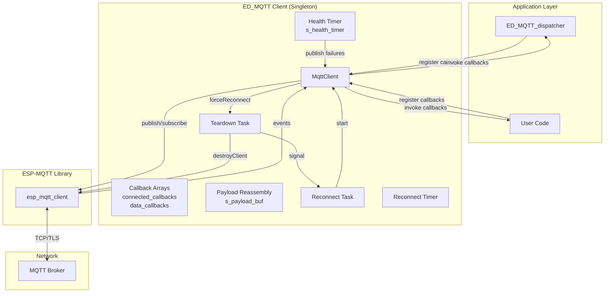

# ED_MQTT Client – Full Documentation

The **ED_MQTT Client** is a singleton wrapper around the ESP‑IDF MQTT library, providing a static, zero‑heap interface for TLS/MQTT5 connections. It handles message reassembly, callback registration, and automatic reconnection after failures. The client is designed for indefinite runtime with no dynamic allocations after initialisation.

## Table of Contents
- [ED\_MQTT Client – Full Documentation](#ed_mqtt-client--full-documentation)
  - [Table of Contents](#table-of-contents)
  - [Overview](#overview)
  - [Architecture Diagram](#architecture-diagram)
  - [Connection \& Reconnection Logic](#connection--reconnection-logic)
  - [Health Monitor](#health-monitor)
  - [Message Reassembly](#message-reassembly)
  - [API Reference](#api-reference)
    - [MqttClient](#mqttclient)
  - [Usage Examples](#usage-examples)
    - [1. Basic Setup](#1-basic-setup)
    - [2. Registering Callbacks](#2-registering-callbacks)
    - [3. Publishing Messages](#3-publishing-messages)
  - [MQTT5 Support](#mqtt5-support)
  - [Configuration](#configuration)
  - [Dependencies \& Integration](#dependencies--integration)
  - [Summary](#summary)

---

## Overview

`ED_MQTT::MqttClient` is a singleton that wraps `esp-mqtt` with the following features:

- **TLS support** using `esp_crt_bundle_attach` (no per‑device certificate storage).
- **MQTT5 protocol** (requires `CONFIG_MQTT_PROTOCOL_5` in sdkconfig).
- **Zero‑heap callbacks** – fixed arrays of function pointers, no `std::function`.
- **Payload reassembly** – static buffer (no `std::string` reallocation).
- **Automatic reconnection** – internal teardown/reconnect tasks that survive broker failures.
- **Health monitoring** – counts publish failures; after `MAX_CONSECUTIVE_FAILURES` (default 3), forces a full reconnect.

The client is designed to be robust against silent broker stalls, TCP half‑open states, and long network outages.

---

## Architecture Diagram


```mermaid
flowchart TD
    subgraph "Application Layer"
        DISP[ED_MQTT_dispatcher]
        APP[User Code]
    end

    subgraph "ED_MQTT Client (Singleton)"
        MQTT[MqttClient]
        CB[Callback Arrays\nconnected_callbacks\ndata_callbacks]
        REASSEM[Payload Reassembly\ns_payload_buf]
        HEALTH[Health Timer\ns_health_timer]
        TEARDOWN[Teardown Task]
        RECONNECT[Reconnect Task]
        TIMER[Reconnect Timer]
    end

    subgraph "ESP-MQTT Library"
        LIB[esp_mqtt_client]
    end

    subgraph "Network"
        BROKER[MQTT Broker]
    end

    APP -->|register callbacks| MQTT
    DISP -->|register callbacks| MQTT
    MQTT -->|publish/subscribe| LIB
    LIB -->|events| MQTT
    MQTT -->|invoke callbacks| APP
    MQTT -->|invoke callbacks| DISP

    HEALTH -->|publish failures| MQTT
    MQTT -->|forceReconnect| TEARDOWN
    TEARDOWN -->|destroyClient| LIB
    TEARDOWN -->|signal| RECONNECT
    RECONNECT -->|start| MQTT

    LIB <-->|TCP/TLS| BROKER
```

---

## Connection & Reconnection Logic

The client maintains a persistent connection using a multi‑stage reconnection system:

1. **Initial connection** – `MqttClient::create()` calls `start()`, which initialises the `esp_mqtt_client` and registers the event trampoline.

2. **On‑the‑fly reconnection** – When a transport error or unexpected disconnect occurs, the `MQTT_EVENT_DISCONNECTED` or `MQTT_EVENT_ERROR` handlers call `forceReconnect()`.

3. **Force reconnection** – `forceReconnect()` stops any pending reconnect timer, notifies the **teardown task**, and schedules a new reconnect timer (1 second later).

4. **Teardown task** – Destroys the current client (`destroyClient()`), resets the `eventsRegistered` flag, and frees the underlying `esp_mqtt_client` handle.

5. **Reconnect task** – Wakes up when the reconnect timer fires. It calls `destroyClient()` again (idempotent) and then `start()` to create a fresh client.

6. **Event re‑registration** – Because `eventsRegistered` was reset, `start()` registers a new trampoline with the new client, ensuring events are delivered.

7. **Connection success** – `MQTT_EVENT_CONNECTED` invokes all registered `connected_callbacks`, which allows the dispatcher to restart its info timer and reset its health flags.

**Key features**:
- The reconnect queue and tasks are recreated automatically if missing (self‑healing).
- All callbacks (connected, data) persist because they are stored in static arrays inside the singleton.
- No memory leaks – old client handles are fully destroyed.

---

## Health Monitor

A FreeRTOS timer (`s_health_timer`) runs every `HEALTH_CHECK_PERIOD_MS` (default 30 seconds). Each time it checks the publish failure counter `s_publish_fail_count`.

- The counter is incremented whenever `publish()` returns an error.
- If the counter reaches `MAX_CONSECUTIVE_FAILURES` (default 3), `forceReconnect()` is called.
- The counter is reset to zero after a successful publish (non‑negative message ID).

This provides a second line of defence: even if the network appears connected, repeated publish errors trigger a client rebuild.

---

## Message Reassembly

The `MQTT_EVENT_DATA` handler reassembles large messages that span multiple `event->data` chunks. A static buffer `s_payload_buf[MAX_MQTT_PAYLOAD]` (default 4096 bytes) is used. Messages larger than the buffer are logged and dropped.

For each message:
- `current_data_offset == 0` indicates a new message: reset `s_payload_len` and store `total_data_len`.
- Incoming data is copied into the buffer.
- When the complete message is received (`complete` flag true), it calls all registered `data_callbacks` with the reassembled payload and a **32‑bit message ID** (preferring an MQTT5 epoch property if available, falling back to `msg_id`).

---

## API Reference

### MqttClient

The class is a singleton. All methods are static except `publish()` and `getHandle()` (which are instance methods but called through `getInstance()`).

| Method | Description |
|--------|-------------|
| `static MqttClient* create(esp_mqtt_client_config_t* config)` | Creates the singleton (first call) or returns existing instance. Use `nullptr` to use the built‑in default config from `secrets.h`. |
| `static MqttClient* getInstance()` | Returns the singleton instance. |
| `static void forceReconnect()` | Tears down the current client and schedules a reconnect. Safe to call from any task. |
| `static void registerReconnectCallback(ReconnectCallback cb)` | Registers a callback invoked when the library forces a reconnect. |
| `void registerConnectedCallback(MqttConnectedCallback cb)` | Registers a callback fired on every successful broker connection. |
| `void registerDataCallback(MqttDataCallback cb)` | Registers a callback fired for every fully reassembled incoming message. |
| `bool publish(const char* topic, const char* message, int qos = 1, bool retain = false)` | Publishes a message. Returns `true` on success (message queued), `false` on error. |
| `esp_mqtt_client_handle_t getHandle()` | Returns the underlying `esp_mqtt_client_handle_t` (for advanced use). |

**Callback Types**:

```cpp
using MqttConnectedCallback = void (*)(esp_mqtt_client_handle_t client);
using MqttDataCallback = void (*)(esp_mqtt_client_handle_t client,
                                  const char *topic, int topicLen,
                                  const char *data, size_t dataLen,
                                  uint32_t msgID);
using ReconnectCallback = void (*)(void);
```

**Compile‑time limits**:
- `MAX_CONNECTED_CALLBACKS = 4`
- `MAX_DATA_CALLBACKS = 4`
- `MAX_MQTT_PAYLOAD = 4096`

---

## Usage Examples

### 1. Basic Setup

```cpp
#include "ED_mqtt.h"
#include "secrets.h"

extern "C" void app_main() {
    esp_mqtt_client_config_t mqtt_cfg = {};
    mqtt_cfg.broker.address.uri = "mqtts://mybroker:8883";
    mqtt_cfg.broker.verification.crt_bundle_attach = esp_crt_bundle_attach;
    mqtt_cfg.credentials.username = MY_MQTT_USER;
    mqtt_cfg.credentials.client_id = "my_device";
    mqtt_cfg.credentials.authentication.password = MY_MQTT_PASS;
    mqtt_cfg.session.protocol_ver = MQTT_PROTOCOL_V_5;

    ED_MQTT::MqttClient *client = ED_MQTT::MqttClient::create(&mqtt_cfg);
    if (!client) {
        ESP_LOGE("MAIN", "MQTT client creation failed");
        return;
    }
    ESP_LOGI("MAIN", "MQTT client created");
}
```

### 2. Registering Callbacks

```cpp
static void on_connected(esp_mqtt_client_handle_t client) {
    ESP_LOGI("MQTT", "Connected to broker");
    esp_mqtt_client_subscribe(client, "cmd", 0);
}

static void on_data(esp_mqtt_client_handle_t client,
                    const char *topic, int topicLen,
                    const char *data, size_t dataLen,
                    uint32_t msgID) {
    ESP_LOGI("MQTT", "Received %.*s: %.*s", topicLen, topic, (int)dataLen, data);
}

static void on_reconnect() {
    ESP_LOGW("MQTT", "Forced reconnect triggered");
}

void app_main() {
    // ... create client ...
    ED_MQTT::MqttClient *client = ED_MQTT::MqttClient::getInstance();
    client->registerConnectedCallback(on_connected);
    client->registerDataCallback(on_data);
    ED_MQTT::MqttClient::registerReconnectCallback(on_reconnect);
}
```

### 3. Publishing Messages

```cpp
bool success = client->publish("sensor/temp", "23.5", 1, false);
if (!success) {
    ESP_LOGE("MQTT", "Publish failed");
}
```

---

## MQTT5 Support

When `CONFIG_MQTT_PROTOCOL_5` is enabled, the client automatically adds a user property `client-id` to every publish (using `esp_mqtt5_client_set_user_property`). This property contains the device name and can be used by the broker for message tracking.

Additionally, the `MQTT_EVENT_DATA` handler attempts to read a user property named `epoch` and uses it as the `msgID` passed to data callbacks (fallback to `event->msg_id` if not present). This allows the broker to embed a timestamp or correlation ID.

To enable MQTT5, add to `sdkconfig`:

    CONFIG_MQTT_PROTOCOL_5=y

---

## Configuration

The client can be configured either by passing a custom `esp_mqtt_client_config_t` to `create()` or by using the built‑in defaults. The default configuration is defined in `setDefaultConfig()`:

- Broker URI: `"mqtts://raspi00:8883"`
- TLS: `esp_crt_bundle_attach` (global CA bundle)
- Credentials: read from `secrets.h` (`ED_MQTT_USERNAME`, `ED_MQTT_PASSWORD`)
- Client ID: `ED_SYS::ESP_std::Device::mqttName()`
- Last Will: topic `devices/<client_id>/status`, message `"offline"`, QoS 1, retained
- Protocol version: MQTT5

**Important**: The built‑in defaults are for development only. In production, you should create your own configuration.

---

## Dependencies & Integration

- **ED_sys** – Provides device name, firmware version, uptime.
- **esp_mqtt** (ESP‑IDF component) – Header `mqtt_client.h`.
- **esp_crt_bundle** – For TLS certificate verification.
- **FreeRTOS** – Tasks, queues, timers, mutexes.

**CMakeLists.txt** (for a component using ED_MQTT):
```cmake
idf_component_register(SRCS "my_component.cpp"
                       INCLUDE_DIRS "."
                       REQUIRES ED_MQTT)
```

The component `ED_MQTT` itself requires:

    REQUIRES mqtt ED_sys

---

## Summary

`ED_MQTT::MqttClient` provides a robust, zero‑heap MQTT wrapper with automatic reconnection, health monitoring, and safe reassembly of large messages. It is designed to work seamlessly with `ED_MQTT_dispatcher` (for command handling) and can be used standalone for any MQTT‑based application.

The recent changes (recreated queue/task in timer callback, forced reconnect on disconnect, reset of `eventsRegistered` in `destroyClient()`) ensure that the client survives any broker failure and recovers automatically without manual intervention.
```