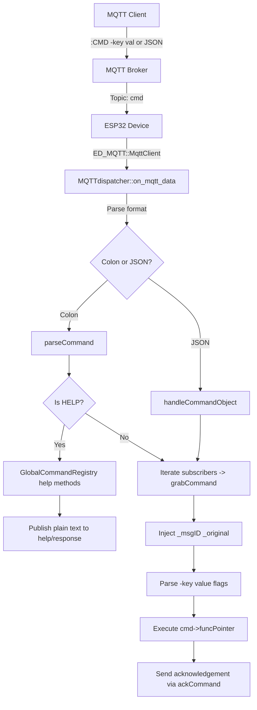
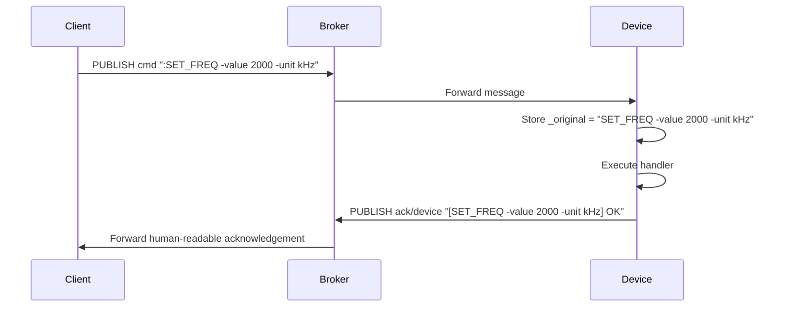

# ED_MQTT_dispatcher – Allocation‑Free MQTT Command Dispatcher

## Overview

`ED_MQTT_dispatcher` provides a **zero‑dynamic‑allocation** framework for handling MQTT commands on ESP32. It supports:

- Colon‑formatted commands (`:CMD -param value`) and JSON commands (`{"cmd":"CMD","data":{...}}`)
- Three‑level help system (overview, registry, command)
- Global registry of registries with a **single project documentation base URL**
- Automatic `_msgID` and `_original` command injection
- Human‑readable acknowledgements that echo the original command

All strings are stored in Flash, all buffers are static, and no `malloc` or `std::function` is used.

---

## Architecture



---

## Core Components

### 1. `ctrlCommand` Structure

Holds a single command's metadata and function pointer.

```cpp
struct ctrlCommand {
    char cmdID[CMD_ID_LEN];               // Command name, e.g. "SET_FREQ"
    const char* cmdDex;                   // Brief description (in Flash)
    CmdParam optParam[MAX_OPT_PARAMS];    // Parameters with defaults
    uint8_t paramCount;                   // Number of parameters
    void (*funcPointer)(ctrlCommand*);    // Handler function
};
```

### 2. `CommandRegistry`

Manages a static array of `ctrlCommand` (max 16). Provides registration, lookup, and help formatting.

### 3. `CommandWithRegistry`

Inherits `iCommandRunner`. Implements `grabCommand()` which:
- Looks up the command by name
- Injects `_msgID` (the MQTT5 epoch) as a parameter
- Injects `_original` (the full command string, e.g., `"SET_FREQ -value 2000 -unit kHz"`)
- Parses colon‑format flags (`-key value`) into the parameter table
- Calls the command's function pointer

### 4. `GlobalCommandRegistry`

Singleton that holds a **single base documentation URL** (set via `setBaseUrl()`) and multiple registries.

**Key methods:**
- `setBaseUrl(const char* url)` – must be called **once** at startup.
- `registerRegistry(regID, registry, briefDesc)` – adds a registry (uses the base URL automatically).
- `getHelpOverview()`, `getRegistryHelp()`, `getCommandHelp()` – implement the three help levels.

### 5. `MQTTdispatcher`

Static class that:
- Initialises MQTT client (waits for IP)
- Subscribes to `cmd` topic
- Parses incoming messages (colon or JSON)
- Routes HELP commands to `GlobalCommandRegistry`
- Routes other commands to registered subscribers
- Provides `ackCommand()` for sending human‑readable acknowledgements

---

## Usage Examples

### Step 1: Define a Command Registry

Create a `CommandRegistry` and register commands. Each handler retrieves `_original` and passes it to `ackCommand`.

```cpp
#include "ED_MQTT_dispatcher.h"

using namespace ED_MQTT_dispatcher;

// Handler for SET_FREQ command
void handleSetFreq(ctrlCommand* cmd) {
    // Original command is already stored
    const char* original = cmd->getParam("_original");

    // Get parameters
    const char* value = cmd->getParam("value");
    const char* unit  = cmd->getParam("unit");

    bool success = setFrequency(atoi(value), unit);

    // Send acknowledgement – original command will be echoed
    MQTTdispatcher::ackCommand(atoll(cmd->getParam("_msgID")), "SET_FREQ",
                               success ? MQTTdispatcher::OK : MQTTdispatcher::FAIL,
                               original);
}

// Handler for ENABLE command
void handleEnable(ctrlCommand* cmd) {
    const char* original = cmd->getParam("_original");
    const char* state = cmd->getParam("state");
    bool success = setDiagnosticState(strcmp(state, "on") == 0);

    MQTTdispatcher::ackCommand(atoll(cmd->getParam("_msgID")), "ENABLE",
                               success ? MQTTdispatcher::OK : MQTTdispatcher::FAIL,
                               original);
}

// Initialise DIAG registry
CommandRegistry diagRegistry;

ctrlCommand cmdSF;
strcpy(cmdSF.cmdID, "SET_FREQ");
cmdSF.cmdDex = "Set frequency";
cmdSF.addParam("value", "1000");
cmdSF.addParam("unit", "Hz");
cmdSF.funcPointer = handleSetFreq;
diagRegistry.registerCommand(cmdSF);

ctrlCommand cmdEN;
strcpy(cmdEN.cmdID, "ENABLE");
cmdEN.cmdDex = "Enable/disable diagnostic";
cmdEN.addParam("state", "on");
cmdEN.funcPointer = handleEnable;
diagRegistry.registerCommand(cmdEN);
```

### Step 2: Initialise Global Help System and Register Registry

```cpp
// In app_main() or early initialisation
GlobalCommandRegistry::instance().setBaseUrl("https://raspi00/EL/HLP/P001");

GlobalCommandRegistry::instance().registerRegistry(
    "DIAG",
    &diagRegistry,
    "Diagnostic commands"
);
```

### Step 3: Start the Dispatcher

```cpp
// In app_main()
MQTTdispatcher::initialize(nullptr);   // Uses default MQTT config from secrets.h
MQTTdispatcher::run();
```

### Step 4: Send Commands from Client

| Command | Effect |
|---------|--------|
| `:SET_FREQ -value 2000 -unit kHz` | Calls `handleSetFreq` with the original command stored |
| `:ENABLE -state off` | Calls `handleEnable` |
| `HELP` | Returns base URL + registry list |
| `HELP DIAG` | Returns brief command list for DIAG |
| `HELP DIAG SET_FREQ` | Returns detailed help for SET_FREQ |

### Step 5: JSON Format (Alternative)

```json
{"cmd":"SET_FREQ","data":{"value":2000,"unit":"kHz"}}
```

The dispatcher automatically converts JSON `data` object into the same parameter table and stores the full `cmd` + `data` as `_original`.

---

## Help System Details

### Setting the Base URL

Call `setBaseUrl()` **exactly once** with the URL of the project’s static HTML documentation page. All anchors are automatically generated:

- Index anchor: `#cmd_index`
- Registry anchor: `#<REGISTRY_ID>` (e.g., `#DIAG`)

If you forget to set the base URL, help commands will return an error message.

### HTML Documentation Page (example: `https://raspi00/EL/HLP/P001`)

```html
<h1 id="cmd_index">Command Registry Index</h1>
<ul>
  <li><a href="#DIAG">DIAG</a> – Diagnostic commands</li>
  <li><a href="#ACT">ACT</a> – Actuator control</li>
</ul>

<h2 id="DIAG">DIAG – Diagnostic commands</h2>
<dl>
  <dt><strong>SET_FREQ</strong> – Set frequency</dt>
  <dd>Parameters:
    <ul><li><code>-value</code> (default: 1000) – frequency in Hz</li>
        <li><code>-unit</code> (default: "Hz") – unit specifier</li></ul>
  </dd>
  <dt><strong>ENABLE</strong> – Enable/disable diagnostic</dt>
  <dd>Parameters:
    <ul><li><code>-state</code> (default: "on") – "on" or "off"</li></ul>
  </dd>
</dl>
```

### Response Examples

**`HELP`**
```text
Documentation: https://raspi00/EL/HLP/P001#cmd_index

Registries:
  DIAG - Diagnostic commands
  ACT - Actuator control
```

**`HELP DIAG`**
```text
Registry DIAG: Diagnostic commands
Documentation: https://raspi00/EL/HLP/P001#DIAG

Commands:
  SET_FREQ - Set frequency
  ENABLE - Enable/disable diagnostic
```

**`HELP DIAG SET_FREQ`**
```text
SET_FREQ: Set frequency
Parameters:
  -value (default: 1000)
  -unit (default: "Hz")
Full details: https://raspi00/EL/HLP/P001#DIAG
```

---

## Acknowledgement Flow



The `ackCommand()` function publishes to topic `ack/<device_id>` with format:

```text
[SET_FREQ -value 2000 -unit kHz] OK
```

The acknowledgement **echoes the exact command** the user typed. No manual string building is required in the handler.

---

## API Reference

### `GlobalCommandRegistry` methods

| Method | Description |
|--------|-------------|
| `instance()` | Returns singleton reference |
| `setBaseUrl(url)` | Sets the project documentation base URL (must be called once) |
| `registerRegistry(id, reg, desc)` | Adds a registry (uses the base URL) |
| `getHelpOverview(buf, len)` | Level 1 help |
| `getRegistryHelp(regID, buf, len)` | Level 2 help |
| `getCommandHelp(regID, cmdID, buf, len)` | Level 3 help |

### `MQTTdispatcher::ackCommand()`

```cpp
void ackCommand(int64_t reqMsgID, const char* commandID,
                ackType ackResult, const char* originalCommand);
```

- `reqMsgID` is the MQTT5 epoch (used internally, not printed)
- `commandID` is the command name (fallback if `originalCommand` is null)
- `ackResult` is either `OK` or `FAIL`
- `originalCommand` should be the value of the `_original` parameter (the full command string)

Output format: `[originalCommand] OK` or `[originalCommand] FAIL`.

---

## Configuration Constants (in `ED_MQTT_dispatcher.h`)

| Constant | Value | Description |
|----------|-------|-------------|
| `MAX_COMMANDS` | 16 | Maximum commands per registry |
| `MAX_OPT_PARAMS` | 8 | Maximum parameters per command (one slot used for `_msgID`, one for `_original`) |
| `MAX_CMD_SUBSCRIBERS` | 4 | Maximum subscribers (legacy, can be reduced) |
| `MAX_REGISTRIES` | 8 | Maximum registries in global registry |
| `CMD_ID_LEN` | 16 | Length of command ID string |
| `PARAM_KEY_LEN` | 16 | Length of parameter key |
| `PARAM_VAL_LEN` | 64 | Length of parameter value (must fit longest command + arguments) |

---

## Memory Footprint

- All command definitions stored in Flash (`.rodata`)
- Each `ctrlCommand` uses ~(16+64+8*(16+64)) = ~720 bytes in RAM if all slots used, but typically much less
- Global registry uses single base URL pointer + `MAX_REGISTRIES * sizeof(RegistryInfo)` ~ 8 * (2*4 + 4) ≈ 96 bytes
- Help buffer: 1024 bytes static
- No heap allocations

---

## Thread Safety

All global data is protected by the recursive mutex inside `ED_MQTT::MqttClient`. The dispatcher does not add its own locks; it relies on the MQTT client's internal mutex for callback serialisation. All operations are therefore thread‑safe.

---

## Integration Notes

- Requires `ED_MQTT`, `ED_S_JSON`, `ED_sys`, `ED_wifi` libraries
- MQTT5 must be enabled (`CONFIG_MQTT_PROTOCOL_5=y`) for epoch property support
- Default MQTT config uses `esp_crt_bundle_attach` for TLS
- Device ID (`mqttName()`) is used for acknowledgement topic

---

## Troubleshooting

| Problem | Likely cause | Solution |
|---------|--------------|----------|
| Commands not executed | Registry not registered or command ID mismatch | Verify `registerRegistry()` and command ID spelling |
| No acknowledgement | Handler didn't call `ackCommand()` | Add `_msgID` retrieval and `ackCommand()` call |
| Help returns "Base URL not set" | `setBaseUrl()` not called | Call `setBaseUrl()` once at startup |
| Help shows wrong base URL | Base URL misspelled | Correct the URL in `setBaseUrl()` |
| MQTT connection fails | IP not ready, or URI not resolvable | Ensure WiFi connected; dispatcher waits for IP |
| Payload too large | `MAX_MQTT_PAYLOAD` (4096) exceeded | Increase constant or split message |
| `_original` is truncated | Command longer than `PARAM_VAL_LEN` | Increase `PARAM_VAL_LEN` in configuration |

---

## License

Proprietary – part of ED_MQTT framework.
```