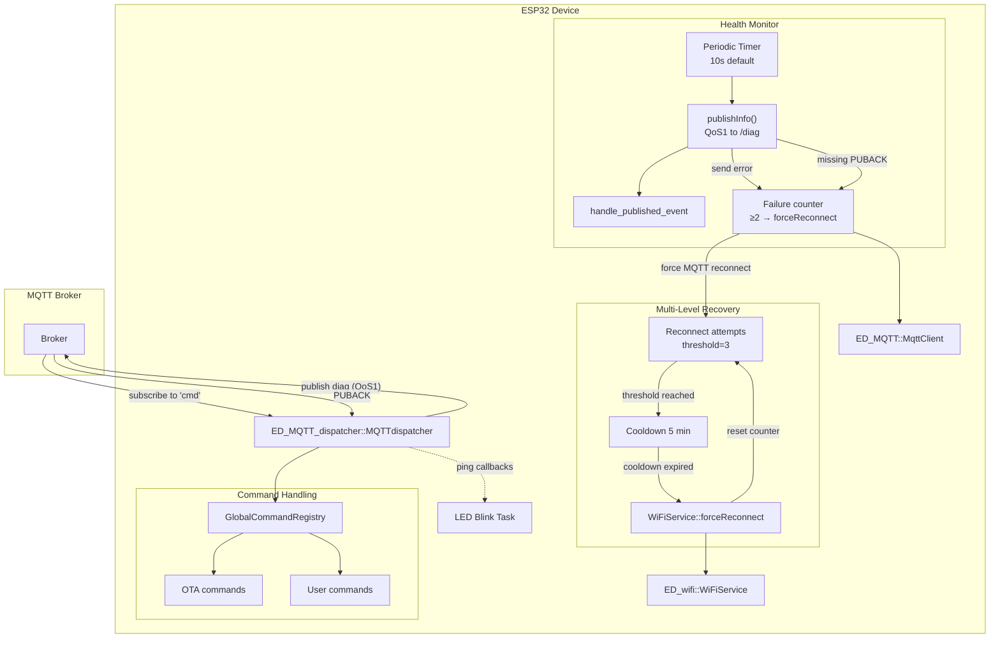
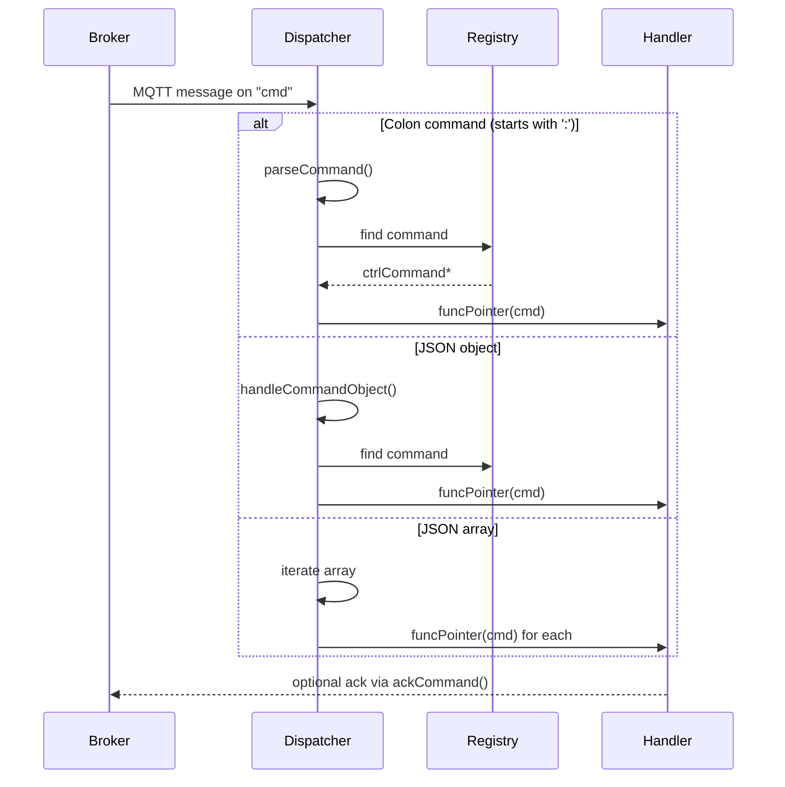

# ED_MQTT Dispatcher – Full Documentation (with Multi‑Level Recovery)

The **ED_MQTT Dispatcher** is a lightweight, zero‑heap MQTT command dispatcher for ESP‑IDF. It integrates with the `ED_MQTT` client, parses incoming messages (colon commands or JSON), routes them to registered command handlers, and includes a built‑in **health monitor** based on periodic diagnostic publishes with QoS 1 and PUBACK tracking.

Additionally, it now implements **multi‑level recovery**: after a configurable number of consecutive MQTT reconnect failures, it triggers a WiFi reconnection (subject to a cooldown) to recover from deeper network issues.

## Table of Contents
- [ED\_MQTT Dispatcher – Full Documentation (with Multi‑Level Recovery)](#ed_mqtt-dispatcher--full-documentation-with-multilevel-recovery)
  - [Table of Contents](#table-of-contents)
  - [Overview](#overview)
  - [Architecture Diagram](#architecture-diagram)
  - [Command Processing Flow](#command-processing-flow)
  - [Health Monitor \& Ping Callbacks](#health-monitor--ping-callbacks)
  - [Multi‑Level Recovery (MQTT → WiFi)](#multilevel-recovery-mqtt--wifi)
  - [API Reference](#api-reference)
    - [MQTTdispatcher](#mqttdispatcher)
    - [ctrlCommand](#ctrlcommand)
    - [CommandRegistry / CommandWithRegistry](#commandregistry--commandwithregistry)
    - [GlobalCommandRegistry](#globalcommandregistry)
  - [Usage Examples](#usage-examples)
    - [1. Basic Setup](#1-basic-setup)
    - [2. Registering a Command (using CommandWithRegistry)](#2-registering-a-command-using-commandwithregistry)
    - [3. Subscribing to Commands (iCommandRunner)](#3-subscribing-to-commands-icommandrunner)
    - [4. Handling Ping Events (LED feedback)](#4-handling-ping-events-led-feedback)
  - [Colon‑Format Command Syntax](#colonformat-command-syntax)
  - [JSON Command Format](#json-command-format)
  - [PFREQ Command (Adjust Diagnostic Period)](#pfreq-command-adjust-diagnostic-period)
  - [Dependencies \& Integration](#dependencies--integration)
  - [Summary](#summary)

---

## Overview

The dispatcher solves three main problems:

1. **Command dispatch** – Listens on MQTT topic `"cmd"`, parses colon commands (`:COMMAND ...`) or JSON objects, and routes them to `iCommandRunner` subscribers or `CommandRegistry` entries.

2. **Periodic device diagnostics** – Every N seconds (default 10, adjustable via `PFREQ`), publishes a JSON object to `devices/<id>/diag` containing uptime, IP, and custom fields from registered providers.

3. **Health monitoring** – The diagnostic message is published with **QoS 1**. When the broker acknowledges it (`MQTT_EVENT_PUBLISHED`), the dispatcher clears the pending flag and resets the failure counter. If **two consecutive pings are sent without receiving a PUBACK**, or if a publish send error occurs twice, the dispatcher calls `ED_MQTT::MqttClient::forceReconnect()` and signals a failure callback.

4. **Multi‑level recovery** – Each forced MQTT reconnect increments an internal counter. When the counter reaches a threshold (default 3), the dispatcher calls `ED_wifi::WiFiService::forceReconnect()`, but at most once every 5 minutes (cooldown). This resets the counter and allows the system to recover from severe network outages.

The dispatcher uses static allocation, fixed callback arrays, and re‑registers MQTT event handlers on every connection (inside `on_mqtt_connected`) to survive full client teardown and reconnect.

---

## Architecture Diagram


```mermaid
flowchart TD
subgraph "MQTT Broker"
B[Broker]
end

subgraph "ESP32 Device"
MQTT[ED_MQTT::MqttClient]
DISP[ED_MQTT_dispatcher::MQTTdispatcher]
WIFI[ED_wifi::WiFiService]

subgraph "Command Handling"
REG[GlobalCommandRegistry]
CMD1[OTA commands]
CMD2[User commands]
end

subgraph "Health Monitor"
TIMER["Periodic Timer
10s default"]
PUB["publishInfo()
QoS1 to /diag"]
ACK[handle_published_event]
FAIL["Failure counter
≥2 → forceReconnect"]
end

subgraph "Multi-Level Recovery"
COUNTER["Reconnect attempts
threshold=3"]
COOLDOWN["Cooldown 5 min"]
WIFI_RECONNECT["WiFiService::forceReconnect"]
end

LED[LED Blink Task]
end

B -- "subscribe to 'cmd'" --> DISP
DISP -- "publish diag (QoS1)" --> B
B -- "PUBACK" --> DISP

DISP --> REG
REG --> CMD1
REG --> CMD2

TIMER --> PUB
PUB --> ACK
PUB --> |send error| FAIL
PUB --> |missing PUBACK| FAIL
FAIL --> |force MQTT reconnect| COUNTER
COUNTER --> |threshold reached| COOLDOWN
COOLDOWN --> |cooldown expired| WIFI_RECONNECT
WIFI_RECONNECT --> WIFI
WIFI_RECONNECT --> |reset counter| COUNTER
FAIL --> MQTT

DISP -. "ping callbacks" .-> LED
```

---

## Command Processing Flow


```mermaid
sequenceDiagram
    participant Broker
    participant Dispatcher
    participant Registry
    participant Handler

    Broker->>Dispatcher: MQTT message on "cmd"
    alt Colon command (starts with ':')
        Dispatcher->>Dispatcher: parseCommand()
        Dispatcher->>Registry: find command
        Registry-->>Dispatcher: ctrlCommand*
        Dispatcher->>Handler: funcPointer(cmd)
    else JSON object
        Dispatcher->>Dispatcher: handleCommandObject()
        Dispatcher->>Registry: find command
        Dispatcher->>Handler: funcPointer(cmd)
    else JSON array
        Dispatcher->>Dispatcher: iterate array
        Dispatcher->>Handler: funcPointer(cmd) for each
    end
    Handler-->>Broker: optional ack via ackCommand()
```

---

## Health Monitor & Ping Callbacks

The health monitor is the core resilience feature. It works as follows:

1. A FreeRTOS timer (`s_info_timer`) triggers every N milliseconds (default 10 seconds, changed via `PFREQ` command).
2. The callback `T_info_timer_callback()` notifies the `info_publisher_task`, which calls `publishInfo()`.
3. `publishInfo()` builds a JSON diagnostic message and publishes it to `devices/<id>/diag` with **QoS 1**.
4. It stores the returned message ID and sets `s_ping_pending = true`.
5. **If the previous ping is still pending** (no PUBACK received yet), `s_ping_fail_count` is incremented. After `PING_MAX_FAILURES` (default 2) consecutive missed acks, the failure callback is invoked and `forceReconnect()` is called.
6. If `esp_mqtt_client_publish()` returns an error, the failure counter also increments; after two such errors, reconnect is forced.
7. When a PUBACK arrives, `handle_published_event()` clears `s_ping_pending`, resets the failure counter, and invokes the **success callback**.
8. On MQTT disconnect, the timer is stopped and the failure callback is invoked to indicate lost connectivity.

**Callback Registration:**
```cpp
// In your main.cpp
static void on_ping_success() {
    // Normal operation: e.g., set LED to normal color
}

static void on_ping_failure() {
    // Problem detected: e.g., set LED to red, blink fast
}

ED_MQTT_dispatcher::MQTTdispatcher::registerPingSuccessCallback(on_ping_success);
ED_MQTT_dispatcher::MQTTdispatcher::registerPingFailureCallback(on_ping_failure);
```

Callbacks are invoked from the MQTT event task context, so they must be fast and non‑blocking.

---

## Multi‑Level Recovery (MQTT → WiFi)

The dispatcher maintains an internal counter `s_mqtt_reconnect_attempts`. Every time `publishInfo()` forces an MQTT reconnect (due to missing PUBACK or publish error), the counter is incremented.

- When `s_mqtt_reconnect_attempts` reaches `MQTT_RECONNECT_THRESHOLD` (default 3), the dispatcher:
  1. Checks the cooldown: `s_last_wifi_reconnect_time` and `WIFI_RECONNECT_COOLDOWN_SEC` (default 300 seconds = 5 minutes).
  2. If the cooldown has expired, it calls `ED_wifi::WiFiService::forceReconnect()`.
  3. Updates `s_last_wifi_reconnect_time` and resets `s_mqtt_reconnect_attempts` to 0.
  4. If the cooldown is still active, it logs a warning and skips the WiFi reset.

- The counter is also reset to 0 on:
  - A successful MQTT connection (`on_mqtt_connected`).
  - A successful PUBACK (`handle_published_event`).

This ensures that:
- The MQTT client recovers automatically from transient broker issues.
- After 3 consecutive MQTT reconnect failures, the WiFi stack is reset (once every 5 minutes).
- The router is not hammered if the broker is down but WiFi is fine.

**Important:** This feature requires that `ED_wifi::WiFiService::forceReconnect()` is implemented (as described in the WiFi documentation).

---

## API Reference

### MQTTdispatcher

All methods are **static**.

| Method | Description |
|--------|-------------|
| `esp_err_t initialize(esp_mqtt_client_config_t* config)` | Initialises the dispatcher with MQTT configuration. Must be called before `run()`. |
| `esp_err_t run()` | Starts the dispatcher (registers IP‑ready callback, creates MQTT client). |
| `void subscribe(iCommandRunner* subscriber)` | Registers a command subscriber (for colon/JSON commands). |
| `void registerJsonFieldProvider(JsonFieldProvider provider)` | Adds a callback that contributes fields to the diagnostic JSON. |
| `void ackCommand(int64_t msgID, const char* cmdID, ackType result, const char* original)` | Sends an acknowledgment to `ack/<device_id>` topic. |
| `void registerPingSuccessCallback(PingSuccessCallback cb)` | Registers a callback invoked on every successful PUBACK. |
| `void registerPingFailureCallback(PingFailureCallback cb)` | Registers a callback invoked on publish errors, missed acks, or disconnect. |
| `void resetMqttReconnectAttempts()` | Manually resets the internal MQTT reconnect counter (optional). |
| `esp_mqtt_client_handle_t getClientHandle()` | Returns the underlying MQTT client handle. |

**Diagnostic JSON Providers:**
```cpp
using JsonFieldProvider = void (*)(ED_S_JSON::StaticJson& doc);
// Example:
void myDiagProvider(ED_S_JSON::StaticJson& doc) {
    doc.addString("myField", "myValue");
}
MQTTdispatcher::registerJsonFieldProvider(myDiagProvider);
```

### ctrlCommand

Structure representing a single command.

| Field | Description |
|-------|-------------|
| `const char* cmdID` | Uppercase command name (e.g., `"FWUP"`). |
| `const char* cmdDex` | Brief description (used in help). |
| `void (*funcPointer)(ctrlCommand*)` | Function called when command is dispatched. |
| `uint8_t paramCount` | Number of parameters. |
| `OptParam optParam[MAX_OPT_PARAMS]` | Array of key‑value parameters. |

**Methods:**
- `const char* getParam(const char* key)` – returns value for given key, or `nullptr`.
- `bool setParam(const char* key, const char* val)` – updates existing parameter.
- `bool addParam(const char* key, const char* default_val)` – adds new parameter.

**Note:** The dispatcher automatically injects special parameters:
- `_msgID` – original MQTT message ID (converted to string).
- `_msgID_raw` – same as above (backup).
- `_original` – full original command string.
- `_default` – first token after command name (if not a flag).

### CommandRegistry / CommandWithRegistry

**CommandRegistry** holds up to 16 `ctrlCommand` entries and provides registration and lookup.

**CommandWithRegistry** is a convenience base class that automatically registers its internal `registry` with the `GlobalCommandRegistry` on construction.

```cpp
class MyCommands : public CommandWithRegistry {
public:
    MyCommands() : CommandWithRegistry("MYREG", "My command group") {
        ctrlCommand cmd;
        cmd.cmdID = "TEST";
        cmd.cmdDex = "Test command";
        cmd.funcPointer = cmd_test;
        registry.registerCommand(cmd);
    }
    static void cmd_test(ctrlCommand* cmd) {
        const char* param = cmd->getParam("somekey");
        // ...
    }
};
```

### GlobalCommandRegistry

Singleton that manages multiple named registries and provides help generation.

| Method | Description |
|--------|-------------|
| `void setBaseUrl(const char* url)` | Sets documentation base URL for help links. |
| `bool registerRegistry(const char* id, CommandRegistry* reg, const char* desc)` | Registers a registry. |
| `void getHelpOverview(char* buf, size_t len)` | Lists all registries. |
| `void getRegistryHelp(const char* id, char* buf, size_t len)` | Lists commands in a registry. |
| `void getCommandHelp(const char* reg, const char* cmd, char* buf, size_t len)` | Shows detailed help for a specific command. |

The dispatcher automatically handles `HELP` commands sent via MQTT.

---

## Usage Examples

### 1. Basic Setup

```cpp
#include "ED_MQTT_dispatcher.h"
#include "ED_wifi.h"
#include "secrets.h"

extern "C" void app_main() {
    ED_wifi::WiFiService::launch();

    esp_mqtt_client_config_t mqtt_cfg = {};
    mqtt_cfg.broker.address.uri = "mqtts://mybroker:8883";
    mqtt_cfg.broker.verification.crt_bundle_attach = esp_crt_bundle_attach;
    mqtt_cfg.credentials.username = MY_MQTT_USER;
    mqtt_cfg.credentials.client_id = ED_SYS::ESP_std::Device::mqttName();
    mqtt_cfg.credentials.authentication.password = MY_MQTT_PASS;
    mqtt_cfg.session.protocol_ver = MQTT_PROTOCOL_V_5;

    ED_MQTT_dispatcher::MQTTdispatcher::initialize(&mqtt_cfg);
    ED_MQTT_dispatcher::MQTTdispatcher::run();

    ED_MQTT_dispatcher::MQTTdispatcher::registerJsonFieldProvider(wifiDiagProvider);

    while (1) {
        vTaskDelay(pdMS_TO_TICKS(10000));
    }
}
```

### 2. Registering a Command (using CommandWithRegistry)

```cpp
#include "ED_MQTT_dispatcher.h"

class MyAppCommands : public ED_MQTT_dispatcher::CommandWithRegistry {
public:
    MyAppCommands() : CommandWithRegistry("MYAPP", "My application commands") {
        ED_MQTT_dispatcher::ctrlCommand cmd;
        cmd.cmdID = "BLINK";
        cmd.cmdDex = "Control onboard LED blink pattern";
        cmd.funcPointer = cmd_blink;
        cmd.addParam("rate_ms", "500");
        cmd.addParam("color", "green");
        registry.registerCommand(cmd);
    }

    static void cmd_blink(ED_MQTT_dispatcher::ctrlCommand* cmd) {
        const char* rate = cmd->getParam("rate_ms");
        const char* color = cmd->getParam("color");
        // Apply LED settings...

        const char* msgid = cmd->getParam("_msgID");
        if (msgid && msgid[0]) {
            int64_t id = atoll(msgid);
            ED_MQTT_dispatcher::MQTTdispatcher::ackCommand(
                id, cmd->cmdID,
                ED_MQTT_dispatcher::MQTTdispatcher::ackType::OK,
                "LED pattern updated");
        }
    }
};

static MyAppCommands myCommands;  // auto‑registers
```

### 3. Subscribing to Commands (iCommandRunner)

```cpp
#include "ED_MQTT_dispatcher.h"

class MySubscriber : public ED_MQTT_dispatcher::iCommandRunner {
public:
    void grabCommand(const char* cmdID, const char* cmdData,
                     size_t dataLen, uint32_t msgID) override {
        ESP_LOGI("SUB", "Command: %s, Data: %.*s", cmdID, (int)dataLen, cmdData);
    }
};

static MySubscriber subscriber;
ED_MQTT_dispatcher::MQTTdispatcher::subscribe(&subscriber);
```

### 4. Handling Ping Events (LED feedback)

```cpp
#include "ED_MQTT_dispatcher.h"

static bool mqtt_healthy = false;

static void on_ping_success() {
    mqtt_healthy = true;
    // Set LED to normal color (e.g., green)
}

static void on_ping_failure() {
    mqtt_healthy = false;
    // Set LED to red, fast blink
}

// In app_main():
ED_MQTT_dispatcher::MQTTdispatcher::registerPingSuccessCallback(on_ping_success);
ED_MQTT_dispatcher::MQTTdispatcher::registerPingFailureCallback(on_ping_failure);
```

---

## Colon‑Format Command Syntax

Commands sent to the `"cmd"` topic must start with a colon `:` followed by the command name and optional flags.

**Syntax:**

    :COMMAND_NAME [default_value] [-flag1 value1] [-flag2 value2] ...

**Examples:**

    :FWUP v2.1.0
    :PFREQ 30s
    :BLINK -rate_ms 200 -color blue
    :HELP OTA

The dispatcher extracts the command name (converted to uppercase) and parses flags. Flags are stored as parameters accessible via `cmd->getParam("flag")`.

**Special auto‑injected parameters:**
- `_msgID` – Original MQTT message ID (for acknowledgment routing).
- `_original` – The full original command string.
- `_default` – The first token after the command name (if not a flag).

---

## JSON Command Format

The dispatcher also accepts JSON messages in two formats:

**Single command object:**
```json
{
    "cmd": "FWUP",
    "data": "v2.1.0"
}
```

**Array of commands:**
```json
[
    {"cmd": "FWUP", "data": "v2.1.0"},
    {"cmd": "BLINK", "data": "-rate_ms 500"}
]
```

Each command is dispatched exactly like a colon command, with the `data` field treated as the command payload.

---

## PFREQ Command (Adjust Diagnostic Period)

The dispatcher listens for the special command `PFREQ` to change the diagnostic publish interval. This does **not** go to command registries – it's handled internally.

**Usage:**

    :PFREQ 30s      # 30 seconds
    :PFREQ 2m       # 2 minutes
    :PFREQ 1h       # 1 hour
    :PFREQ 0        # disable periodic ping
    :PFREQ D        # disable (alternative)

The period affects both the diagnostic message rate and the health check interval.

---

## Dependencies & Integration

- **ED_MQTT** – Wrapper around esp‑mqtt client.
- **ED_S_JSON** – Static JSON builder (no dynamic allocation).
- **ED_sys** – Provides device name, firmware version, uptime.
- **ED_wifi** – Provides IP address, AP info, and the `forceReconnect()` method.
- **esp‑mqtt** – ESP‑IDF component (header `mqtt_client.h`).

**CMakeLists.txt requirements:**
```cmake
idf_component_register(SRCS "ED_MQTT_dispatcher.cpp"
                       INCLUDE_DIRS "."
                       REQUIRES mqtt ED_MQTT ED_S_JSON ED_sys ED_wifi)
```

---

## Summary

The ED_MQTT Dispatcher provides a robust, zero‑heap solution for:
- Parsing and dispatching MQTT commands (colon or JSON).
- Periodic device diagnostics with custom fields.
- Application‑level health monitoring using QoS 1 publishes and PUBACK tracking.
- Automatic MQTT reconnect after two consecutive failures (missing acks or send errors).
- Multi‑level recovery: after 3 MQTT reconnect attempts, a WiFi reset is triggered (once every 5 minutes) to recover from deep network issues.
- Callback integration for visual feedback (LEDs) or other actions.

The health monitor and multi‑level recovery together ensure that the device remains operational and reachable even after prolonged broker outages or WiFi disruptions.
```