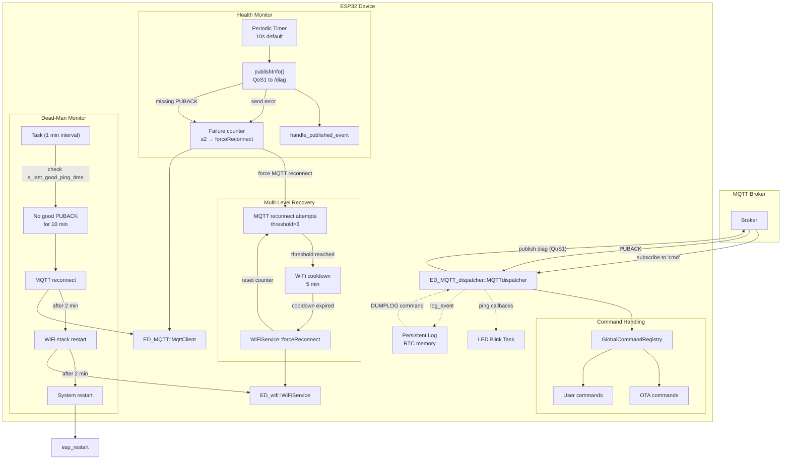

# ED_MQTT Dispatcher – Complete Documentation

The **ED_MQTT Dispatcher** is a lightweight, zero‑heap MQTT command dispatcher and health monitor for ESP‑IDF. It integrates with `ED_MQTT::MqttClient`, parses incoming messages (colon commands or JSON), routes them to registered handlers, and includes a multi‑layer recovery system that guarantees reconnection even after long broker outages.

## Table of Contents
- [ED\_MQTT Dispatcher – Complete Documentation](#ed_mqtt-dispatcher--complete-documentation)
  - [Table of Contents](#table-of-contents)
  - [Overview](#overview)
  - [Architecture](#architecture)
  - [Command Processing](#command-processing)
    - [Colon Command Flow](#colon-command-flow)
    - [JSON Command Flow](#json-command-flow)
  - [Health Monitor \& Ping Callbacks](#health-monitor--ping-callbacks)
  - [Multi‑Level Recovery (MQTT → WiFi)](#multilevel-recovery-mqtt--wifi)
  - [Dead‑Man Monitor \& Escalation](#deadman-monitor--escalation)
  - [Persistent Logging \& DUMPLOG Command](#persistent-logging--dumplog-command)
  - [API Reference](#api-reference)
    - [MQTTdispatcher (public static methods)](#mqttdispatcher-public-static-methods)
    - [ctrlCommand](#ctrlcommand)
    - [CommandRegistry / CommandWithRegistry](#commandregistry--commandwithregistry)
    - [GlobalCommandRegistry](#globalcommandregistry)
  - [Usage Examples](#usage-examples)
    - [Basic Setup](#basic-setup)
    - [Registering Commands with CommandWithRegistry](#registering-commands-with-commandwithregistry)
    - [Subscribing as iCommandRunner](#subscribing-as-icommandrunner)
    - [Adding Diagnostic Fields](#adding-diagnostic-fields)
    - [Handling Ping Events (LED feedback)](#handling-ping-events-led-feedback)
    - [Retrieving the Persistent Log](#retrieving-the-persistent-log)
  - [Command Syntax](#command-syntax)
    - [Colon Commands](#colon-commands)
    - [JSON Commands](#json-commands)
  - [PFREQ Command](#pfreq-command)
  - [Dependencies \& Integration](#dependencies--integration)
  - [Troubleshooting](#troubleshooting)
  - [Summary](#summary)

---

## Overview

The dispatcher provides:

1. **Command dispatch** – listens on MQTT topic `"cmd"`, parses colon commands (e.g. `:FWUP v2.1.0 -force`) or JSON objects, and routes them to registered `iCommandRunner` subscribers or `CommandRegistry` entries.
2. **Periodic device diagnostics** – every N seconds (default 10, adjustable via `PFREQ`) publishes a JSON object to `devices/<id>/diag` containing uptime, IP, and custom fields added via `registerJsonFieldProvider`.
3. **Health monitoring** – the diagnostic message is published with QoS 1. When the broker acknowledges it (`MQTT_EVENT_PUBLISHED`), the dispatcher clears a pending flag and resets the failure counter. If two consecutive pings are missed (or a send error occurs), it forces an MQTT reconnect.
4. **Multi‑level recovery** – tracks MQTT reconnect attempts. After 6 attempts, it triggers a WiFi reset (once every 5 minutes) to recover from deeper network issues.
5. **Dead‑man monitor** – a separate task checks every minute for the last good PUBACK. If no PUBACK for 10 minutes → MQTT reconnect; if still none after 2 more minutes → full WiFi stack restart; after another 2 minutes → system restart. Logs every step.
6. **Persistent logging** – a circular buffer in RTC memory stores key events across reboots. The log can be retrieved remotely with the `DUMPLOG` command.

All components use static allocation – no `std::function`, no dynamic memory after initialisation.

---

## Architecture


```mermaid
flowchart TD
    subgraph "MQTT Broker"
        B[Broker]
    end

    subgraph "ESP32 Device"
        MQTT[ED_MQTT::MqttClient]
        DISP[ED_MQTT_dispatcher::MQTTdispatcher]
        WIFI[ED_wifi::WiFiService]

        subgraph "Command Handling"
            REG[GlobalCommandRegistry]
            CMD1[OTA commands]
            CMD2[User commands]
        end

        subgraph "Health Monitor"
            TIMER["Periodic Timer<br>10s default"]
            PUB["publishInfo()<br>QoS1 to /diag"]
            ACK[handle_published_event]
            FAIL["Failure counter<br>≥2 → forceReconnect"]
        end

        subgraph "Multi-Level Recovery"
            COUNTER["MQTT reconnect attempts<br>threshold=6"]
            COOLDOWN["WiFi cooldown<br>5 min"]
            WIFI_RECONNECT[WiFiService::forceReconnect]
        end

        subgraph "Dead‑Man Monitor"
            DEADMAN_TASK["Task (1 min interval)"]
            TIMEOUT["No good PUBACK<br>for 10 min"]
            ESCALATE1[MQTT reconnect]
            ESCALATE2[WiFi stack restart]
            ESCALATE3[System restart]
        end

        LED[LED Blink Task]
        LOG[Persistent Log<br>RTC memory]
    end

    B -- "subscribe to 'cmd'" --> DISP
    DISP -- "publish diag (QoS1)" --> B
    B -- "PUBACK" --> DISP

    DISP --> REG
    REG --> CMD1
    REG --> CMD2

    TIMER --> PUB
    PUB --> ACK
    PUB --> |send error| FAIL
    PUB --> |missing PUBACK| FAIL
    FAIL --> |force MQTT reconnect| COUNTER
    COUNTER --> |threshold reached| COOLDOWN
    COOLDOWN --> |cooldown expired| WIFI_RECONNECT
    WIFI_RECONNECT --> WIFI
    WIFI_RECONNECT --> |reset counter| COUNTER
    FAIL --> MQTT

    DEADMAN_TASK --> |check s_last_good_ping_time| TIMEOUT
    TIMEOUT --> ESCALATE1
    ESCALATE1 --> |after 2 min| ESCALATE2
    ESCALATE2 --> |after 2 min| ESCALATE3
    ESCALATE1 --> MQTT
    ESCALATE2 --> WIFI
    ESCALATE3 --> esp_restart

    DISP -. "ping callbacks" .-> LED
    DISP -. "log_event" .-> LOG
    LOG -. "DUMPLOG command" .-> DISP
```

---

## Command Processing

The dispatcher processes messages from the MQTT topic `"cmd"` in two formats: **colon commands** (starting with `:`) and **JSON** (single object or array).

### Colon Command Flow

1. The string is parsed: the first token after `:` is the command ID (converted to uppercase). Subsequent tokens are either a default value or `-key value` flags.
2. The dispatcher looks up the command in the `GlobalCommandRegistry`. If found, it calls the registered function pointer, passing a `ctrlCommand*` that contains the parameters (including auto‑injected `_msgID`, `_original`, `_default`).
3. The command handler can then call `ackCommand()` to send an acknowledgment.

### JSON Command Flow

- Single object: `{"cmd": "FWUP", "data": "v2.1.0"}` → same as `:FWUP v2.1.0`.
- Array of objects: each object is dispatched in order.

---

## Health Monitor & Ping Callbacks

- Every `s_info_timer` period (default 10s), `publishInfo()` sends a QoS 1 message to `devices/<id>/diag`.
- It stores the message ID and sets `s_ping_pending = true`.
- If the previous ping is still pending when the timer fires again, `s_ping_fail_count` is incremented.
- After **2 consecutive missed PUBACKs** (or a publish send error), `s_ping_failure_cb` is called and `forceReconnect()` is triggered.
- When a PUBACK arrives, `handle_published_event()` clears `s_ping_pending`, resets the failure counter, updates `s_last_good_ping_time`, and calls `s_ping_success_cb`.

**Callback Registration:**

```cpp
static void on_ping_success() {
    // normal LED (green, version colour)
}
static void on_ping_failure() {
    // red LED, fast blink
}
MQTTdispatcher::registerPingSuccessCallback(on_ping_success);
MQTTdispatcher::registerPingFailureCallback(on_ping_failure);
```

---

## Multi‑Level Recovery (MQTT → WiFi)

- Each time the health monitor forces an MQTT reconnect, `s_mqtt_reconnect_attempts` is incremented.
- When this counter reaches `MQTT_RECONNECT_THRESHOLD` (default **6**), the dispatcher calls `ED_wifi::WiFiService::forceReconnect()` **only if** at least `WIFI_RECONNECT_COOLDOWN_SEC` (default 300 seconds = 5 minutes) has passed since the last WiFi reset.
- The counter resets to `0` after a WiFi reset or after a successful PUBACK / connection.
- This prevents flooding the router with WiFi reconnects when the broker alone is down.

---

## Dead‑Man Monitor & Escalation

A separate FreeRTOS task (`mqtt_deadman`) runs every **60 seconds**. It checks the time since the last good PUBACK (`s_last_good_ping_time`). If no PUBACK has been received for:

- **10 minutes** → forces an MQTT reconnect (`ED_MQTT::MqttClient::forceReconnect()`).
- **+2 more minutes (12 minutes total)** → forces a full WiFi stack restart (`ED_wifi::WiFiService::forceReconnect()`). This destroys and recreates the network interface.
- **+2 more minutes (14 minutes total)** → restarts the entire ESP (`esp_restart()`).

Each step is logged to both the console and the persistent log.

---

## Persistent Logging & DUMPLOG Command

The dispatcher maintains a **2KB circular log buffer** in RTC memory (internal SRAM, not flash/NVS). This buffer survives software reboots (including `esp_restart()`) but not power cycles – perfect for capturing events leading to a failure.

**Logged events include:**
- MQTT connect / disconnect
- Info ping sent / PUBACK received
- Missing PUBACKs and forced reconnects
- WiFi stack restarts and system restarts (dead‑man actions)

**To retrieve the log remotely, send the MQTT command:**

    :DUMPLOG

The dispatcher will publish the log (up to 1500 bytes) to the topic `devices/<device_id>/dumplog`. You can subscribe to that topic to receive the log. If MQTT is completely dead, the log will be printed to the console on the next reboot (because `log_event` also prints to console).

**Implementation details:**
- Memory: `RTC_DATA_ATTR` – no NVS wear.
- Buffer size: 2048 bytes (wraps, keeping the last ~1024 bytes).
- Enabled by default. To disable, comment out the `log_event` calls and the static buffer definitions (not recommended for production debugging).

---

## API Reference

### MQTTdispatcher (public static methods)

| Method | Description |
|--------|-------------|
| `esp_err_t initialize(esp_mqtt_client_config_t* config)` | Creates timers, tasks, and the dead‑man monitor. Must be called before `run()`. |
| `esp_err_t run()` | Subscribes to IP‑ready event and starts MQTT client creation. |
| `void subscribe(iCommandRunner* subscriber)` | Registers a class that implements `grabCommand()`. |
| `void registerJsonFieldProvider(JsonFieldProvider provider)` | Adds custom fields to the diagnostic JSON. |
| `void ackCommand(int64_t msgID, const char* cmdID, ackType result, const char* original)` | Sends acknowledgment to `ack/<device_id>`. |
| `void registerPingSuccessCallback(PingSuccessCallback cb)` | Called on every successful PUBACK. |
| `void registerPingFailureCallback(PingFailureCallback cb)` | Called on missed PUBACK, send error, or disconnect. |
| `void resetMqttReconnectAttempts()` | Resets the MQTT reconnect counter. |
| `void cmd_dumplog(ctrlCommand* cmd)` | Command handler for `DUMPLOG`. Publishes persistent log. |
| `void log_event(const char* fmt, ...)` | Logs an event to both console and the circular buffer. |

### ctrlCommand

Structure representing a command.

| Field | Description |
|-------|-------------|
| `const char* cmdID` | Uppercase command name (e.g., `"FWUP"`). |
| `const char* cmdDex` | Brief description (used in help). |
| `void (*funcPointer)(ctrlCommand*)` | Function called when command is dispatched. |
| `uint8_t paramCount` | Number of parameters. |
| `OptParam optParam[MAX_OPT_PARAMS]` | Key‑value parameters. |

**Methods:**
- `const char* getParam(const char* key)` – returns value for given key, or `nullptr`.
- `bool setParam(const char* key, const char* val)` – updates existing parameter.
- `bool addParam(const char* key, const char* default_val)` – adds new parameter.

**Auto‑injected parameters:**
- `_msgID` – original MQTT message ID (as string).
- `_msgID_raw` – same (backup).
- `_original` – full original command string.
- `_default` – first token after command name (if not a flag).

### CommandRegistry / CommandWithRegistry

- `CommandRegistry` holds up to 16 commands. Use `registerCommand()` to add them.
- `CommandWithRegistry` is a base class that automatically registers its `registry` with the `GlobalCommandRegistry` on construction. Derive from it and add commands in the constructor.

### GlobalCommandRegistry

Singleton that manages multiple registries and provides help generation.

| Method | Description |
|--------|-------------|
| `void setBaseUrl(const char* url)` | Sets documentation base URL for help links. |
| `bool registerRegistry(const char* id, CommandRegistry* reg, const char* desc)` | Registers a registry. |
| `void getHelpOverview(char* buf, size_t len)` | Lists all registries. |
| `void getRegistryHelp(const char* id, char* buf, size_t len)` | Lists commands in a registry. |
| `void getCommandHelp(const char* reg, const char* cmd, char* buf, size_t len)` | Shows detailed help for a specific command. |

The dispatcher automatically handles `HELP` commands sent via MQTT.

---

## Usage Examples

### Basic Setup

```cpp
#include "ED_MQTT_dispatcher.h"
#include "ED_wifi.h"
#include "secrets.h"

extern "C" void app_main() {
    ED_wifi::WiFiService::launch();
    esp_mqtt_client_config_t mqtt_cfg = {};
    mqtt_cfg.broker.address.uri = "mqtts://mybroker:8883";
    mqtt_cfg.broker.verification.crt_bundle_attach = esp_crt_bundle_attach;
    mqtt_cfg.credentials.username = MY_MQTT_USER;
    mqtt_cfg.credentials.client_id = ED_SYS::ESP_std::Device::mqttName();
    mqtt_cfg.credentials.authentication.password = MY_MQTT_PASS;
    mqtt_cfg.session.protocol_ver = MQTT_PROTOCOL_V_5;

    ED_MQTT_dispatcher::MQTTdispatcher::initialize(&mqtt_cfg);
    ED_MQTT_dispatcher::MQTTdispatcher::run();

    ED_MQTT_dispatcher::MQTTdispatcher::registerJsonFieldProvider(wifiDiagProvider);

    while (1) {
        vTaskDelay(pdMS_TO_TICKS(10000));
    }
}
```

### Registering Commands with CommandWithRegistry

```cpp
#include "ED_MQTT_dispatcher.h"

class MyCommands : public ED_MQTT_dispatcher::CommandWithRegistry {
public:
    MyCommands() : CommandWithRegistry("MYAPP", "My application commands") {
        ED_MQTT_dispatcher::ctrlCommand cmd;
        cmd.cmdID = "BLINK";
        cmd.cmdDex = "Control onboard LED blink pattern";
        cmd.funcPointer = cmd_blink;
        cmd.addParam("rate_ms", "500");   // default 500ms
        cmd.addParam("color", "green");
        registry.registerCommand(cmd);
    }

    static void cmd_blink(ED_MQTT_dispatcher::ctrlCommand* cmd) {
        const char* rate = cmd->getParam("rate_ms");
        const char* color = cmd->getParam("color");
        int rate_ms = rate ? atoi(rate) : 500;
        // Apply LED settings...
        // Send acknowledgment
        const char* msgid = cmd->getParam("_msgID");
        if (msgid && msgid[0]) {
            int64_t id = atoll(msgid);
            ED_MQTT_dispatcher::MQTTdispatcher::ackCommand(
                id, cmd->cmdID,
                ED_MQTT_dispatcher::MQTTdispatcher::ackType::OK,
                "LED pattern updated");
        }
    }
};

static MyCommands myCommands;  // auto‑registers
```

### Subscribing as iCommandRunner

```cpp
#include "ED_MQTT_dispatcher.h"

class MySubscriber : public ED_MQTT_dispatcher::iCommandRunner {
public:
    void grabCommand(const char* cmdID, const char* cmdData,
                     size_t dataLen, uint32_t msgID) override {
        ESP_LOGI("SUB", "Command: %s, Data: %.*s, MsgID: %lu",
                 cmdID, (int)dataLen, cmdData, msgID);
        // Handle command...
    }
};

static MySubscriber subscriber;
ED_MQTT_dispatcher::MQTTdispatcher::subscribe(&subscriber);
```

### Adding Diagnostic Fields

```cpp
#include "ED_MQTT_dispatcher.h"
#include "ED_S_JSON.h"

void wifiDiagProvider(ED_S_JSON::StaticJson& doc) {
    doc.addString("ssid", "MyNetwork");
    doc.addInt("rssi", -45);
}
// Register in app_main():
MQTTdispatcher::registerJsonFieldProvider(wifiDiagProvider);
```

### Handling Ping Events (LED feedback)

```cpp
static bool mqtt_healthy = false;

static void on_ping_success() {
    mqtt_healthy = true;
    set_led(0, 255, 0); // green
}

static void on_ping_failure() {
    mqtt_healthy = false;
    set_led(255, 0, 0); // red
}

// In app_main():
ED_MQTT_dispatcher::MQTTdispatcher::registerPingSuccessCallback(on_ping_success);
ED_MQTT_dispatcher::MQTTdispatcher::registerPingFailureCallback(on_ping_failure);
```

### Retrieving the Persistent Log

Send the command:

    :DUMPLOG

Subscribe to the response topic (replace `ESP_32:97:54` with your device ID):

    mosquitto_sub -t "devices/ESP_32:97:54/dumplog" -h <broker_ip>

Example output:

    [2025-06-11 10:23:45] MQTT connected
    [2025-06-11 10:23:55] Info ping sent msgID=12345
    [2025-06-11 10:24:05] PUBACK received for msgID=12345
    [2025-06-11 10:24:15] Info ping sent msgID=12346
    [2025-06-11 10:24:25] Missing PUBACK for msgID=12346, fail count=1/2
    [2025-06-11 10:24:35] Too many missed PUBACKs, forcing reconnect

---

## Command Syntax

### Colon Commands

Messages to `"cmd"` must start with `:` followed by the command name and optional flags.

**Syntax:**

    :COMMAND_NAME [default_value] [-flag1 value1] [-flag2 value2] ...

**Examples:**

    :FWUP v2.1.0
    :PFREQ 30s
    :BLINK -rate_ms 200 -color blue
    :HELP OTA

The dispatcher extracts the command name (converted to uppercase) and parses flags. Flags are stored as parameters accessible via `cmd->getParam("flag")`.

**Special auto‑injected parameters:**
- `_msgID` – Original MQTT message ID (for acknowledgment routing).
- `_original` – The full original command string.
- `_default` – The first token after the command name (if not a flag).

### JSON Commands

**Single command object:**

    {"cmd": "FWUP", "data": "v2.1.0"}

**Array of commands:**

    [
        {"cmd": "FWUP", "data": "v2.1.0"},
        {"cmd": "BLINK", "data": "-rate_ms 500"}
    ]

---

## PFREQ Command

The dispatcher listens for the special command `PFREQ` to change the diagnostic publish interval (and health check frequency). This does **not** go to command registries – it's handled internally.

**Usage:**

    :PFREQ 30s      # 30 seconds
    :PFREQ 2m       # 2 minutes
    :PFREQ 1h       # 1 hour
    :PFREQ 0        # disable
    :PFREQ D        # disable (alternative)

The period affects both the diagnostic message rate and the health check interval.

---

## Dependencies & Integration

- **ED_MQTT** – MQTT client wrapper.
- **ED_S_JSON** – Static JSON builder.
- **ED_sys** – Provides device name, firmware version, uptime.
- **ED_wifi** – Provides IP address, AP info, and `forceReconnect()`.

**CMakeLists.txt:**

```cmake
idf_component_register(SRCS "ED_MQTT_dispatcher.cpp"
                       INCLUDE_DIRS "."
                       REQUIRES mqtt ED_MQTT ED_S_JSON ED_sys ED_wifi)
```

To enable the dead‑man and persistent log (default enabled), no extra steps are needed. If you need to disable persistent logging, remove the `log_event` calls and the static buffer definitions from the source.

---

## Troubleshooting

| Symptom | Likely cause | Action |
|---------|--------------|--------|
| LED stays red after broker restart | Missing PUBACK (reason code 16) | Check broker ACL and MQTT5 user properties. |
| No pings sent | Info timer not started | Ensure `on_mqtt_connected` was called (check logs). |
| Dead‑man restarts system repeatedly | WiFi stack cannot connect | Check WiFi credentials, signal strength, DHCP. |
| `DUMPLOG` returns nothing | Persistent log empty or MQTT down | Wait for at least one event, or read console on reboot. |
| Reconnection never happens after full restart | `forceReconnect()` not triggering teardown | Check `ED_mqtt.cpp` modifications (reconnect timer, queue). |

---

## Summary

The dispatcher provides three independent recovery layers:

1. **Fast recovery** – After 2 missed pings → MQTT reconnect.
2. **Slower recovery** – After 6 MQTT reconnects → WiFi reset (once every 5 min).
3. **Dead‑man monitor** – After 10 min without any PUBACK → MQTT reconnect; after 12 min → WiFi stack restart; after 14 min → system restart.

The **persistent log** (RTC memory) records all key events, and the `DUMPLOG` command lets you retrieve it remotely. Together, these features ensure that a headless device will always recover from broker outages, WiFi disruptions, or internal stuck states, and you can diagnose any failure without physical access.
```