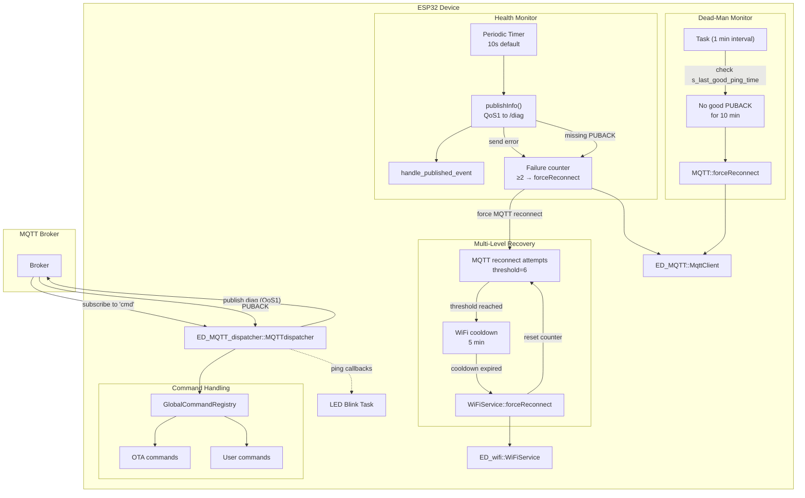
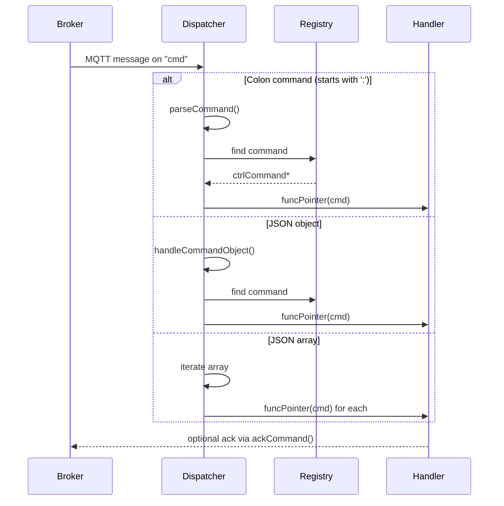

# ED_MQTT Dispatcher – Full Documentation (Final Robust Version)

The **ED_MQTT Dispatcher** is a lightweight, zero‑heap MQTT command dispatcher for ESP‑IDF. It integrates with the `ED_MQTT` client, parses incoming messages (colon commands or JSON), routes them to registered handlers, and includes a **multi‑layer recovery system** that guarantees reconnection even after long broker outages.

## Table of Contents
- [ED\_MQTT Dispatcher – Full Documentation (Final Robust Version)](#ed_mqtt-dispatcher--full-documentation-final-robust-version)
  - [Table of Contents](#table-of-contents)
  - [Overview](#overview)
  - [Architecture Diagram](#architecture-diagram)
  - [Command Processing Flow](#command-processing-flow)
  - [Health Monitor \& Ping Callbacks](#health-monitor--ping-callbacks)
  - [Multi‑Level Recovery (MQTT → WiFi)](#multilevel-recovery-mqtt--wifi)
  - [Dead‑Man Monitor (Ultimate Safety Net)](#deadman-monitor-ultimate-safety-net)
  - [API Reference](#api-reference)
  - [Usage Examples](#usage-examples)
    - [Basic Setup](#basic-setup)
    - [Registering Commands](#registering-commands)
    - [Handling Ping Events (LED feedback)](#handling-ping-events-led-feedback)
  - [Command Syntax](#command-syntax)
    - [Colon Commands](#colon-commands)
    - [JSON Commands](#json-commands)
  - [PFREQ Command](#pfreq-command)
  - [Dependencies](#dependencies)
  - [Summary](#summary)

---

## Overview

The dispatcher provides:

1. **Command dispatch** – Listens on `"cmd"`, parses `:COMMAND ...` or JSON, routes to registered `iCommandRunner` or `CommandRegistry`.
2. **Periodic device diagnostics** – Publishes a JSON object to `devices/<id>/diag` every N seconds (default 10). Contains uptime, IP, and custom fields.
3. **Health monitoring** – Uses QoS 1 publishes. Missing PUBACKs increment a counter; after 2 consecutive missed acks, forces an MQTT reconnect.
4. **Multi‑level recovery** – Tracks MQTT reconnect attempts. After 6 reconnects, triggers a WiFi reset (once every 5 min) to recover from deeper network issues.
5. **Dead‑man monitor** – A separate task checks for successful PUBACKs every minute. If none received for 10 minutes, it forces an MQTT reconnect (no system restart). This ensures the device never stays offline indefinitely.

All components are statically allocated – no `std::function` or dynamic memory after initialisation.

---

## Architecture Diagram


```mermaid
flowchart TD
    subgraph "MQTT Broker"
        B[Broker]
    end

    subgraph "ESP32 Device"
        MQTT[ED_MQTT::MqttClient]
        DISP[ED_MQTT_dispatcher::MQTTdispatcher]
        WIFI[ED_wifi::WiFiService]

        subgraph "Command Handling"
            REG[GlobalCommandRegistry]
            CMD1[OTA commands]
            CMD2[User commands]
        end

        subgraph "Health Monitor"
            TIMER["Periodic Timer<br>10s default"]
            PUB["publishInfo()<br>QoS1 to /diag"]
            ACK[handle_published_event]
            FAIL["Failure counter<br>≥2 → forceReconnect"]
        end

        subgraph "Multi-Level Recovery"
            COUNTER["MQTT reconnect attempts<br>threshold=6"]
            COOLDOWN["WiFi cooldown<br>5 min"]
            WIFI_RECONNECT[WiFiService::forceReconnect]
        end

        subgraph "Dead‑Man Monitor"
            DEADMAN_TASK["Task (1 min interval)"]
            TIMEOUT["No good PUBACK<br>for 10 min"]
            FORCE_RECONNECT["MQTT::forceReconnect"]
        end

        LED[LED Blink Task]
    end

    B -- "subscribe to 'cmd'" --> DISP
    DISP -- "publish diag (QoS1)" --> B
    B -- "PUBACK" --> DISP

    DISP --> REG
    REG --> CMD1
    REG --> CMD2

    TIMER --> PUB
    PUB --> ACK
    PUB --> |send error| FAIL
    PUB --> |missing PUBACK| FAIL
    FAIL --> |force MQTT reconnect| COUNTER
    COUNTER --> |threshold reached| COOLDOWN
    COOLDOWN --> |cooldown expired| WIFI_RECONNECT
    WIFI_RECONNECT --> WIFI
    WIFI_RECONNECT --> |reset counter| COUNTER
    FAIL --> MQTT

    DEADMAN_TASK --> |check s_last_good_ping_time| TIMEOUT
    TIMEOUT --> FORCE_RECONNECT
    FORCE_RECONNECT --> MQTT

    DISP -. "ping callbacks" .-> LED
```

---

## Command Processing Flow


```mermaid
sequenceDiagram
    participant Broker
    participant Dispatcher
    participant Registry
    participant Handler

    Broker->>Dispatcher: MQTT message on "cmd"
    alt Colon command (starts with ':')
        Dispatcher->>Dispatcher: parseCommand()
        Dispatcher->>Registry: find command
        Registry-->>Dispatcher: ctrlCommand*
        Dispatcher->>Handler: funcPointer(cmd)
    else JSON object
        Dispatcher->>Dispatcher: handleCommandObject()
        Dispatcher->>Registry: find command
        Dispatcher->>Handler: funcPointer(cmd)
    else JSON array
        Dispatcher->>Dispatcher: iterate array
        Dispatcher->>Handler: funcPointer(cmd) for each
    end
    Handler-->>Broker: optional ack via ackCommand()
```

---

## Health Monitor & Ping Callbacks

- The `s_info_timer` triggers every N seconds (default 10, adjustable via `PFREQ`). It notifies `info_publisher_task`, which calls `publishInfo()`.
- `publishInfo()` sends a QoS 1 message to `devices/<id>/diag` and stores the message ID (`s_last_ping_msg_id`), setting `s_ping_pending = true`.
- If, on the next timer tick, `s_ping_pending` is still `true` (no PUBACK received), `s_ping_fail_count` is incremented.
- After **2 consecutive missed PUBACKs** (or a publish send error), `s_ping_failure_cb` is called and `forceReconnect()` is triggered.
- When a PUBACK arrives, `handle_published_event()` clears `s_ping_pending`, resets the failure counter, updates `s_last_good_ping_time`, and calls `s_ping_success_cb`.

**Callback Registration:**

```cpp
static void on_ping_success() {
    // normal LED (green, version colour)
}

static void on_ping_failure() {
    // red LED, fast blink
}
MQTTdispatcher::registerPingSuccessCallback(on_ping_success);
MQTTdispatcher::registerPingFailureCallback(on_ping_failure);
```

---

## Multi‑Level Recovery (MQTT → WiFi)

- Each time the health monitor forces an MQTT reconnect, `s_mqtt_reconnect_attempts` is incremented.
- When this counter reaches `MQTT_RECONNECT_THRESHOLD` (default **6**), the dispatcher calls `ED_wifi::WiFiService::forceReconnect()` **only if** at least `WIFI_RECONNECT_COOLDOWN_SEC` (default 300 s = 5 minutes) has elapsed since the last WiFi reset.
- The counter resets to `0` after a WiFi reset or after a successful PUBACK / connection.
- This prevents flooding the router with WiFi reconnects when the broker alone is down.

**Constants (defined in the header):**

```cpp
static constexpr uint8_t MQTT_RECONNECT_THRESHOLD = 6;
static constexpr int64_t WIFI_RECONNECT_COOLDOWN_SEC = 300;
```

---

## Dead‑Man Monitor (Ultimate Safety Net)

A separate FreeRTOS task (`mqtt_deadman`) runs every **60 seconds**. It checks the time since the last successful PUBACK (`s_last_good_ping_time`). If no PUBACK has been received for **10 minutes**, it calls `ED_MQTT::MqttClient::forceReconnect()` **without** restarting WiFi or the system.

- This task is independent of the info timer and the health monitor.
- It catches any stalled state where the info timer may have stopped or PUBACKs are never received (e.g., TCP half‑open, broker silent).
- It does **not** reset the WiFi stack – only MQTT – so it is safe and lightweight.

**Implementation (inside `initialize()`):**

```cpp
xTaskCreate([](void*) {
    const int64_t TIMEOUT_SEC = 600; // 10 minutes
    while (1) {
        vTaskDelay(pdMS_TO_TICKS(60000)); // check every minute
        int64_t now = esp_timer_get_time() / 1000000;
        if (s_last_good_ping_time > 0 && (now - s_last_good_ping_time) > TIMEOUT_SEC) {
            ESP_LOGW(TAG, "Dead‑man: No good PUBACK for %lld seconds, forcing MQTT reconnect", now - s_last_good_ping_time);
            ED_MQTT::MqttClient::forceReconnect();
            s_last_good_ping_time = now; // avoid immediate re‑trigger
        }
    }
}, "mqtt_deadman", 2048, NULL, 1, NULL);
```

---

## API Reference

| Method | Description |
|--------|-------------|
| `esp_err_t initialize(esp_mqtt_client_config_t* config)` | Creates timers, tasks, and the dead‑man monitor. Must be called before `run()`. |
| `esp_err_t run()` | Subscribes to IP‑ready event and starts MQTT client creation. |
| `void subscribe(iCommandRunner* subscriber)` | Registers a class that implements `grabCommand()`. |
| `void registerJsonFieldProvider(JsonFieldProvider provider)` | Adds custom fields to the diagnostic JSON. |
| `void ackCommand(int64_t msgID, const char* cmdID, ackType result, const char* original)` | Sends acknowledgment to `ack/<device_id>`. |
| `void registerPingSuccessCallback(PingSuccessCallback cb)` | Called on every successful PUBACK. |
| `void registerPingFailureCallback(PingFailureCallback cb)` | Called on missed PUBACK, send error, or disconnect. |
| `void resetMqttReconnectAttempts()` | Resets the MQTT reconnect counter (useful for testing). |

**Diagnostic JSON Provider:**

```cpp
using JsonFieldProvider = void (*)(ED_S_JSON::StaticJson& doc);
void wifiDiagProvider(ED_S_JSON::StaticJson& doc) {
    doc.addString("ssid", "MyNetwork");
    doc.addInt("rssi", -45);
}
MQTTdispatcher::registerJsonFieldProvider(wifiDiagProvider);
```

**Command Subscriber Interface (iCommandRunner):**

```cpp
class iCommandRunner {
public:
    virtual void grabCommand(const char* commandID, const char* commandData,
                             size_t dataLen, uint32_t msgID) = 0;
    virtual ~iCommandRunner() = default;
};
```

---

## Usage Examples

### Basic Setup

```cpp
#include "ED_MQTT_dispatcher.h"
#include "ED_wifi.h"

extern "C" void app_main() {
    ED_wifi::WiFiService::launch();
    esp_mqtt_client_config_t cfg = {}; // fill with broker details
    ED_MQTT_dispatcher::MQTTdispatcher::initialize(&cfg);
    ED_MQTT_dispatcher::MQTTdispatcher::run();
    // Register callbacks, providers, etc.
    while (1) vTaskDelay(pdMS_TO_TICKS(10000));
}
```

### Registering Commands

Using `CommandWithRegistry` (auto‑registers with global registry):

```cpp
class MyCommands : public ED_MQTT_dispatcher::CommandWithRegistry {
public:
    MyCommands() : CommandWithRegistry("MYREG", "My commands") {
        ED_MQTT_dispatcher::ctrlCommand cmd;
        cmd.cmdID = "BLINK";
        cmd.cmdDex = "Control LED blink";
        cmd.funcPointer = cmd_blink;
        cmd.addParam("rate_ms", "500");
        registry.registerCommand(cmd);
    }
    static void cmd_blink(ED_MQTT_dispatcher::ctrlCommand* cmd) {
        const char* rate = cmd->getParam("rate_ms");
        // ...
    }
};
static MyCommands myCommands; // auto‑registered on construction
```

### Handling Ping Events (LED feedback)

```cpp
static bool mqtt_healthy = false;

static void on_ping_success() {
    mqtt_healthy = true;
    set_led(0, 255, 0); // green
}

static void on_ping_failure() {
    mqtt_healthy = false;
    set_led(255, 0, 0); // red
}

// In app_main():
ED_MQTT_dispatcher::MQTTdispatcher::registerPingSuccessCallback(on_ping_success);
ED_MQTT_dispatcher::MQTTdispatcher::registerPingFailureCallback(on_ping_failure);
```

---

## Command Syntax

### Colon Commands

Messages to `"cmd"` must start with `:`, then command name, then optional flags.

**Syntax:**

    :COMMAND_NAME [default_value] [-flag1 value1] [-flag2 value2] ...

**Examples:**

    :FWUP v2.1.0
    :PFREQ 30s
    :BLINK -rate_ms 200 -color blue
    :HELP OTA

Special auto‑injected parameters: `_msgID`, `_original`, `_default`.

### JSON Commands

**Single object:**

```json
{"cmd": "FWUP", "data": "v2.1.0"}
```

**Array of commands:**

```json
[
    {"cmd": "FWUP", "data": "v2.1.0"},
    {"cmd": "BLINK", "data": "-rate_ms 500"}
]
```

---

## PFREQ Command

Changes the diagnostic publish interval (and health check frequency).

    :PFREQ 30s      # 30 seconds
    :PFREQ 2m       # 2 minutes
    :PFREQ 1h       # 1 hour
    :PFREQ 0        # disable
    :PFREQ D        # disable

---

## Dependencies

- **ED_MQTT** – MQTT client wrapper.
- **ED_S_JSON** – Static JSON builder.
- **ED_sys** – Device name, uptime.
- **ED_wifi** – For `forceReconnect()` (optional, used only in multi‑level recovery).

**CMakeLists.txt:**

```cmake
idf_component_register(SRCS "ED_MQTT_dispatcher.cpp"
                       INCLUDE_DIRS "."
                       REQUIRES mqtt ED_MQTT ED_S_JSON ED_sys ED_wifi)
```

---

## Summary

The dispatcher now includes **three independent recovery layers**:

1. **Fast recovery** – After 2 missed pings → MQTT reconnect.
2. **Slower recovery** – After 6 MQTT reconnects → WiFi reset (once every 5 min).
3. **Dead‑man monitor** – After 10 minutes without any PUBACK → MQTT reconnect.

Together, these ensure that a headless device will **always** recover from broker outages, WiFi disconnections, or internal stuck states, without requiring a system reboot. The dead‑man monitor is lightweight and non‑interfering, making it a perfect safety net for long‑running deployments.
```