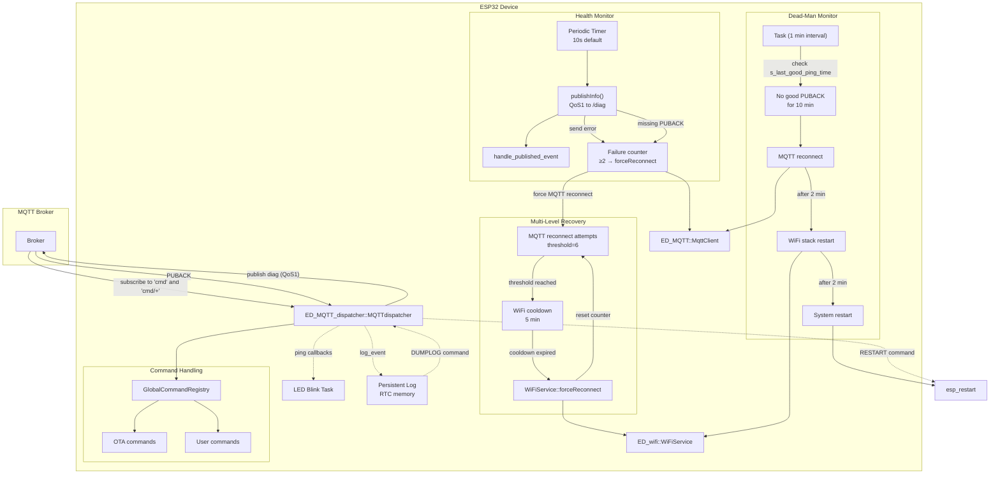

# ED_MQTT Dispatcher – Complete Documentation

The **ED_MQTT Dispatcher** is a lightweight, zero‑heap MQTT command dispatcher and health monitor for ESP‑IDF. It integrates with `ED_MQTT::MqttClient`, parses incoming messages (colon commands or JSON), routes them to registered handlers, and includes a **multi‑layer recovery system** with **compact persistent logging** (RTC memory) that survives software reboots. Built‑in commands `DUMPLOG` and `RESTART` allow remote debugging and recovery, including device‑specific targeting.

## Table of Contents
- [ED\_MQTT Dispatcher – Complete Documentation](#ed_mqtt-dispatcher--complete-documentation)
  - [Table of Contents](#table-of-contents)
  - [Overview](#overview)
  - [Architecture](#architecture)
  - [Command Processing](#command-processing)
    - [Colon Command Flow](#colon-command-flow)
    - [JSON Command Flow](#json-command-flow)
  - [Health Monitor \& Ping Callbacks](#health-monitor--ping-callbacks)
  - [Multi‑Level Recovery (MQTT → WiFi)](#multilevel-recovery-mqtt--wifi)
  - [Dead‑Man Monitor \& Escalation](#deadman-monitor--escalation)
  - [Persistent Logging \& DUMPLOG Command](#persistent-logging--dumplog-command)
    - [Delta‑Based Circular Log Format](#deltabased-circular-log-format)
    - [Event Codes](#event-codes)
    - [Retrieving the Log](#retrieving-the-log)
    - [Example Output](#example-output)
  - [Soft Restart \& Device‑Specific Commands](#soft-restart--devicespecific-commands)
    - [Command Usage](#command-usage)
    - [Behaviour](#behaviour)
    - [Examples](#examples)
    - [Device‑Specific Any Command](#devicespecific-any-command)
  - [API Reference](#api-reference)
    - [MQTTdispatcher](#mqttdispatcher)
  - [Usage Examples](#usage-examples)
    - [Basic Setup](#basic-setup)
    - [Registering Commands](#registering-commands)
    - [Handling Ping Events (LED feedback)](#handling-ping-events-led-feedback)
  - [Command Syntax](#command-syntax)
    - [Colon Commands](#colon-commands)
    - [JSON Commands](#json-commands)
  - [PFREQ Command](#pfreq-command)
  - [Dependencies](#dependencies)
  - [Troubleshooting](#troubleshooting)
  - [Summary](#summary)

---

## Overview

The dispatcher provides:

1. **Command dispatch** – listens on MQTT topics `"cmd"` (general) and `"cmd/<device_id>"` (device‑specific). Parses colon commands (`:COMMAND ...`) or JSON objects, and routes them to registered `iCommandRunner` subscribers or `CommandRegistry` entries.
2. **Periodic device diagnostics** – every N seconds (default 10, adjustable via `PFREQ`) publishes a JSON object to `devices/<id>/diag` containing uptime, IP, and custom fields.
3. **Health monitoring** – the diagnostic message is published with QoS 1. If two consecutive PUBACKs are missed, it forces an MQTT reconnect.
4. **Multi‑level recovery** – tracks MQTT reconnect attempts. After 6 attempts, triggers a WiFi reset (once every 5 min).
5. **Dead‑man monitor** – a separate task checks every minute for the last successful PUBACK. Escalation: 10 min → MQTT reconnect; 12 min → WiFi stack restart; 14 min → system restart. All steps are logged.
6. **Persistent logging** – a compact circular buffer in RTC memory stores key events (3 bytes per event). The log survives `esp_restart()` (soft reboot) but not power cycles. The `DUMPLOG` command publishes the log in multiple MQTT messages with page headers.
7. **Soft restart & device‑specific commands** – the `RESTART` command (sent to `cmd` or `cmd/<device_id>`) triggers a soft reboot (`esp_restart()`). Any colon command can be targeted to a single device by publishing to `cmd/<device_id>`.

All components use static allocation – no `std::function`, no dynamic memory after initialisation.

---

## Architecture


```mermaid
flowchart TD
    subgraph "MQTT Broker"
        B[Broker]
    end

    subgraph "ESP32 Device"
        MQTT[ED_MQTT::MqttClient]
        DISP[ED_MQTT_dispatcher::MQTTdispatcher]
        WIFI[ED_wifi::WiFiService]

        subgraph "Command Handling"
            REG[GlobalCommandRegistry]
            CMD1[OTA commands]
            CMD2[User commands]
        end

        subgraph "Health Monitor"
            TIMER["Periodic Timer<br>10s default"]
            PUB["publishInfo()<br>QoS1 to /diag"]
            ACK[handle_published_event]
            FAIL["Failure counter<br>≥2 → forceReconnect"]
        end

        subgraph "Multi-Level Recovery"
            COUNTER["MQTT reconnect attempts<br>threshold=6"]
            COOLDOWN["WiFi cooldown<br>5 min"]
            WIFI_RECONNECT[WiFiService::forceReconnect]
        end

        subgraph "Dead‑Man Monitor"
            DEADMAN_TASK["Task (1 min interval)"]
            TIMEOUT["No good PUBACK<br>for 10 min"]
            ESCALATE1[MQTT reconnect]
            ESCALATE2[WiFi stack restart]
            ESCALATE3[System restart]
        end

        LED[LED Blink Task]
        LOG[Persistent Log<br>RTC memory]
    end

    B -- "subscribe to 'cmd' and 'cmd/+'" --> DISP
    DISP -- "publish diag (QoS1)" --> B
    B -- "PUBACK" --> DISP

    DISP --> REG
    REG --> CMD1
    REG --> CMD2

    TIMER --> PUB
    PUB --> ACK
    PUB --> |send error| FAIL
    PUB --> |missing PUBACK| FAIL
    FAIL --> |force MQTT reconnect| COUNTER
    COUNTER --> |threshold reached| COOLDOWN
    COOLDOWN --> |cooldown expired| WIFI_RECONNECT
    WIFI_RECONNECT --> WIFI
    WIFI_RECONNECT --> |reset counter| COUNTER
    FAIL --> MQTT

    DEADMAN_TASK --> |check s_last_good_ping_time| TIMEOUT
    TIMEOUT --> ESCALATE1
    ESCALATE1 --> |after 2 min| ESCALATE2
    ESCALATE2 --> |after 2 min| ESCALATE3
    ESCALATE1 --> MQTT
    ESCALATE2 --> WIFI
    ESCALATE3 --> esp_restart

    DISP -. "ping callbacks" .-> LED
    DISP -. "log_event" .-> LOG
    LOG -. "DUMPLOG command" .-> DISP
    DISP -. "RESTART command" .-> esp_restart
```

---

## Command Processing

The dispatcher processes messages from two MQTT topics:
- `"cmd"` – general commands (processed by all devices subscribing to this topic).
- `"cmd/<device_id>"` – device‑specific commands (only the device with matching ID processes them). The device ID is the MQTT client ID set in the configuration (typically `ED_SYS::ESP_std::Device::mqttName()`).

The message format can be **colon commands** (starting with `:`) or **JSON** (single object or array).

### Colon Command Flow

1. The string is parsed: the first token after `:` is the command ID (converted to uppercase). Subsequent tokens are either a default value or `-key value` flags.
2. The dispatcher looks up the command in the `GlobalCommandRegistry`. If found, it calls the registered function pointer, passing a `ctrlCommand*` that contains the parameters (including auto‑injected `_msgID`, `_original`, `_default`).
3. The command handler can then call `ackCommand()` to send an acknowledgment.

### JSON Command Flow

- Single object: `{"cmd": "FWUP", "data": "v2.1.0"}` → same as `:FWUP v2.1.0`.
- Array of objects: each object is dispatched in order.

---

## Health Monitor & Ping Callbacks

- Every `s_info_timer` period (default 10s), `publishInfo()` sends a QoS 1 message to `devices/<id>/diag`.
- It stores the message ID and sets `s_ping_pending = true`.
- If the previous ping is still pending when the timer fires again, `s_ping_fail_count` is incremented.
- After **2 consecutive missed PUBACKs** (or a publish send error), `s_ping_failure_cb` is called and `forceReconnect()` is triggered.
- When a PUBACK arrives, `handle_published_event()` clears `s_ping_pending`, resets the failure counter, updates `s_last_good_ping_time`, and calls `s_ping_success_cb`.

**Callback Registration:**

```cpp
static void on_ping_success() {
    // normal LED (green, version colour)
}
static void on_ping_failure() {
    // red LED, fast blink
}
MQTTdispatcher::registerPingSuccessCallback(on_ping_success);
MQTTdispatcher::registerPingFailureCallback(on_ping_failure);
```

---

## Multi‑Level Recovery (MQTT → WiFi)

- Each time the health monitor forces an MQTT reconnect, `s_mqtt_reconnect_attempts` is incremented.
- When this counter reaches `MQTT_RECONNECT_THRESHOLD` (default **6**), the dispatcher calls `ED_wifi::WiFiService::forceReconnect()` **only if** at least `WIFI_RECONNECT_COOLDOWN_SEC` (default 300 seconds = 5 minutes) has passed since the last WiFi reset.
- The counter resets to `0` after a WiFi reset or after a successful PUBACK / connection.
- This prevents flooding the router with WiFi reconnects when the broker alone is down.

---

## Dead‑Man Monitor & Escalation

A separate FreeRTOS task (`mqtt_deadman`) runs every **60 seconds**. It checks the time since the last good PUBACK (`s_last_good_ping_time`). If no PUBACK has been received for:

- **10 minutes** → forces an MQTT reconnect (`ED_MQTT::MqttClient::forceReconnect()`).
- **+2 more minutes (12 minutes total)** → forces a full WiFi stack restart (`ED_wifi::WiFiService::forceReconnect()`). This destroys and recreates the network interface.
- **+2 more minutes (14 minutes total)** → restarts the entire ESP (`esp_restart()`).

Each step is logged to the persistent log (and console). This guarantees the device never stays offline indefinitely.

---

## Persistent Logging & DUMPLOG Command

The dispatcher maintains a **compact delta‑based circular log buffer** in RTC memory. RTC memory is **internal SRAM** that survives software reboots (e.g., `esp_restart()`) but not power cycles. This means after a deliberate system restart (last resort), you can still retrieve the events that led to the restart.

The log is enabled by default (`ED_MQTT_DISPATCHER_ENABLE_PERSISTENT_LOG` macro). To disable it, comment out the `#define` at the top of the header.

### Delta‑Based Circular Log Format

- **Buffer size**: 2046 bytes (RTC memory).
- **Entry size**: 3 bytes = 1 byte event code + 2 bytes delta (milliseconds since previous event).
- **Maximum entries**: 682 events.
- **Base timestamp**: absolute milliseconds (since boot) of the oldest event stored separately.
- **Wrapping**: When the buffer is full, the oldest event is overwritten, and the base time is advanced by the delta of the removed event. The log always contains the most recent 682 events.

When you send `:DUMPLOG`, the dispatcher reconstructs absolute timestamps by starting from the stored base time and adding each delta sequentially. Because the buffer may be full, the header shows the absolute uptime of the oldest event in the buffer, allowing you to correlate with the `d_UPT` field in the diagnostic JSON.

The buffer is stored using the `__attribute__((section(".rtc_noinit")))` attribute, which ensures it is not cleared on soft reboot (called by `esp_restart()`). A magic number is used to detect first boot or corruption.

### Event Codes

Each event is represented by a single byte code. The following codes are logged:

| Code | Event | Meaning |
|------|-------|---------|
| 1 | `IP_READY` | Wi‑Fi IP obtained, MQTT client creation starts |
| 2 | `MQTT_CONNECTED` | MQTT connection established (PUBACK possible) |
| 3 | `MQTT_DISCONNECTED` | MQTT connection lost (broker or network) |
| 4 | `INFO_PING_SENT` | Diagnostic ping successfully queued (QoS1) |
| 5 | `PUBACK_RECEIVED` | Broker acknowledged a ping (good health) |
| 6 | `MISSING_PUBACK` | Timer fired while previous ping still pending |
| 7 | `FORCE_RECONNECT` | Health monitor triggered an MQTT reconnect |
| 8 | `WIFI_RECONNECT` | Multi‑level recovery triggered a WiFi reset |
| 9 | `DEAD_MAN_MQTT` | Dead‑man: 10 min no PUBACK → MQTT reconnect |
| 10 | `DEAD_MAN_WIFI` | Dead‑man: after +2 min → WiFi stack restart |
| 11 | `DEAD_MAN_RESTART` | Dead‑man: after +2 more min → system restart |
| 12 | `PUBLISH_ERROR` | `esp_mqtt_client_publish` returned error |
| 13 | `THRESHOLD_REACHED` | MQTT reconnect attempts reached threshold (6) |
| 14 | `TOO_MANY_MISSED` | Two consecutive missed PUBACKs |
| 15 | `INFO_PING_SKIPPED` | Publish skipped because MQTT not ready |
| 16 | `RECONNECT_ATTEMPT` | MQTT reconnect attempt count incremented |
| 17 | `SOFT_REBOOT` | Soft reboot triggered by `RESTART` command |

These codes allow full reconstruction of the sequence of events leading to a failure.

### Retrieving the Log

Send the command `:DUMPLOG` to the MQTT topic `"cmd"` (or `cmd/<device_id>` for a specific device). The dispatcher responds by publishing the log in **multiple messages** (each up to ~1400 bytes) to topics:

    devices/<your_device_id>/dumplog/1
    devices/<your_device_id>/dumplog/2
    ...

The first message contains a header with the total number of events and the absolute uptime of the oldest event. Subsequent messages start with a simple page header `=== Page X ===`. Each message contains up to about 70 lines of events.

Subscribe to the base topic `devices/<your_device_id>/dumplog/#` to receive all parts.

**Example using `mosquitto_pub` and `mosquitto_sub`:**

    mosquitto_pub -t "cmd" -m ":DUMPLOG" -h <broker_ip>
    mosquitto_sub -t "devices/ESP_32:97:54/dumplog/#" -h <broker_ip>

### Example Output

**First message:**

    === 120 events (oldest at 1234.567 sec uptime) ===
    [  0.000] IP ready
    [  0.034] MQTT connected
    [ 10.000] Ping sent
    [ 10.023] PUBACK
    [ 20.000] Ping sent
    [ 20.018] PUBACK
    ... (more lines)

**Second message (if needed):**

    === Page 2 ===
    [ 120.000] Missing PUBACK
    [ 120.000] Too many missed
    [ 120.000] Force reconnect
    [ 120.000] Reconnect attempt
    [ 122.000] MQTT connected
    ...

If the ESP later restarts due to the dead‑man (code 11), the log will still be present in RTC memory. After reboot, you can send `:DUMPLOG` again and see the events from before the restart (the log is not cleared on software reboot). This gives you a complete breadcrumb trail.

**Note:** Power cycling the ESP (removing power) will erase the log, as RTC memory loses content. For debugging, keep the device powered.

---

## Soft Restart & Device‑Specific Commands

The dispatcher provides a built‑in command `RESTART` that performs a soft reboot of the ESP32. This is useful for remote recovery when the device is unresponsive but still reachable via MQTT.

### Command Usage

`RESTART` can be sent in two ways:
- **General command** – publish to the main topic `"cmd"`. Any device subscribed to `cmd` will reboot.
- **Device‑specific command** – publish to `cmd/<device_id>`, where `<device_id>` is the device’s MQTT client ID (e.g., `cmd/ESP_32:97:54`). Only the device with that ID will reboot. This allows targeted reboots without affecting other devices.

### Behaviour

The device will:
- Log a `SOFT_REBOOT` event (code 17) to the persistent log.
- Send an acknowledgment to `ack/<device_id>` with the message "Rebooting...".
- Wait 1 second to allow the acknowledgment to be sent.
- Call `esp_restart()`.

All MQTT state is lost, but the persistent log in RTC memory **survives** the restart. After reboot, you can send `:DUMPLOG` to see the events leading up to the restart.

### Examples

**General restart (all devices):**

    mosquitto_pub -t "cmd" -m ":RESTART" -h <broker_ip>

**Device‑specific restart:**

    mosquitto_pub -t "cmd/ESP_32:97:54" -m ":RESTART" -h <broker_ip>

The acknowledgment will appear on `ack/ESP_32:97:54`.

### Device‑Specific Any Command

The dispatcher supports sending **any colon command** (not only `RESTART`) to the device‑specific topic `cmd/<device_id>`. For example, you can send `:FWUP v2.1.0` to `cmd/ESP_32:97:54` to update only that device.

This is achieved by subscribing to `cmd/+` and filtering by the topic suffix. No additional configuration is needed.

---

## API Reference

### MQTTdispatcher

All methods are **static**.

| Method | Description |
|--------|-------------|
| `esp_err_t initialize(esp_mqtt_client_config_t* config)` | Creates timers, tasks, and the dead‑man monitor. |
| `esp_err_t run()` | Subscribes to IP‑ready event and starts MQTT client creation. |
| `void subscribe(iCommandRunner* subscriber)` | Registers a command subscriber (colon/JSON commands). |
| `void registerJsonFieldProvider(JsonFieldProvider provider)` | Adds custom fields to the diagnostic JSON. |
| `void ackCommand(int64_t msgID, const char* cmdID, ackType result, const char* original)` | Sends acknowledgment to `ack/<device_id>`. |
| `void registerPingSuccessCallback(PingSuccessCallback cb)` | Called on every successful PUBACK. |
| `void registerPingFailureCallback(PingFailureCallback cb)` | Called on missed PUBACK, send error, or disconnect. |
| `void resetMqttReconnectAttempts()` | Resets the MQTT reconnect counter. |
| `void cmd_dumplog(ctrlCommand* cmd)` | Command handler for `DUMPLOG` (built‑in). |

**Diagnostic JSON Provider:**

```cpp
using JsonFieldProvider = void (*)(ED_S_JSON::StaticJson& doc);
void wifiDiagProvider(ED_S_JSON::StaticJson& doc) {
    doc.addString("ssid", "MyNetwork");
    doc.addInt("rssi", -45);
}
MQTTdispatcher::registerJsonFieldProvider(wifiDiagProvider);
```

---

## Usage Examples

### Basic Setup

```cpp
#include "ED_MQTT_dispatcher.h"
#include "ED_wifi.h"

extern "C" void app_main() {
    ED_wifi::WiFiService::launch();
    esp_mqtt_client_config_t mqtt_cfg = {}; // fill with broker details
    ED_MQTT_dispatcher::MQTTdispatcher::initialize(&mqtt_cfg);
    ED_MQTT_dispatcher::MQTTdispatcher::run();
    // Register callbacks, providers, etc.
    while (1) vTaskDelay(pdMS_TO_TICKS(10000));
}
```

### Registering Commands

Using `CommandWithRegistry` (auto‑registers with global registry):

```cpp
class MyCommands : public ED_MQTT_dispatcher::CommandWithRegistry {
public:
    MyCommands() : CommandWithRegistry("MYREG", "My commands") {
        ED_MQTT_dispatcher::ctrlCommand cmd;
        cmd.cmdID = "BLINK";
        cmd.cmdDex = "Control LED blink";
        cmd.funcPointer = cmd_blink;
        cmd.addParam("rate_ms", "500");
        registry.registerCommand(cmd);
    }
    static void cmd_blink(ED_MQTT_dispatcher::ctrlCommand* cmd) {
        const char* rate = cmd->getParam("rate_ms");
        // ...
    }
};
static MyCommands myCommands; // auto‑registered on construction
```

### Handling Ping Events (LED feedback)

```cpp
static bool mqtt_healthy = false;

static void on_ping_success() {
    mqtt_healthy = true;
    set_led(0, 255, 0); // green
}

static void on_ping_failure() {
    mqtt_healthy = false;
    set_led(255, 0, 0); // red
}

// In app_main():
ED_MQTT_dispatcher::MQTTdispatcher::registerPingSuccessCallback(on_ping_success);
ED_MQTT_dispatcher::MQTTdispatcher::registerPingFailureCallback(on_ping_failure);
```

---

## Command Syntax

### Colon Commands

    :COMMAND_NAME [default_value] [-flag1 value1] [-flag2 value2] ...

**Examples:**

    :FWUP v2.1.0
    :PFREQ 30s
    :BLINK -rate_ms 200 -color blue
    :HELP OTA
    :DUMPLOG
    :RESTART

Special auto‑injected parameters: `_msgID`, `_original`, `_default`.

### JSON Commands

**Single object:**

    {"cmd": "FWUP", "data": "v2.1.0"}

**Array of commands:**

    [
        {"cmd": "FWUP", "data": "v2.1.0"},
        {"cmd": "BLINK", "data": "-rate_ms 500"}
    ]

---

## PFREQ Command

Changes the diagnostic publish interval (and health check frequency).

    :PFREQ 30s      # 30 seconds
    :PFREQ 2m       # 2 minutes
    :PFREQ 1h       # 1 hour
    :PFREQ 0        # disable
    :PFREQ D        # disable

---

## Dependencies

- **ED_MQTT** – MQTT client wrapper.
- **ED_S_JSON** – Static JSON builder.
- **ED_sys** – Device name, uptime.
- **ED_wifi** – For `forceReconnect()` (optional).

**CMakeLists.txt:**

```cmake
idf_component_register(SRCS "ED_MQTT_dispatcher.cpp"
                       INCLUDE_DIRS "."
                       REQUIRES mqtt ED_MQTT ED_S_JSON ED_sys ED_wifi)
```

---

## Troubleshooting

| Symptom | Likely cause | Action |
|---------|--------------|--------|
| LED stays red after broker restart | Missing PUBACK (reason code 16) | Check broker ACL and MQTT5 user properties. |
| No pings sent | Info timer not started | Ensure `on_mqtt_connected` was called (check log). |
| Dead‑man restarts system repeatedly | WiFi stack cannot connect | Check WiFi credentials, signal strength, DHCP. |
| `DUMPLOG` returns no messages | Log buffer empty or MQTT down | Wait for at least one event, or read console on reboot. |
| Log shows only a few events | Buffer may be full, oldest events overwritten | This is expected – the log always shows the most recent 682 events. |
| Multiple log parts not received | MQTT client subscription not matching wildcard | Subscribe to `devices/<id>/dumplog/#`. |
| `RESTART` command does nothing | Command not enabled (macro may be disabled) | Ensure `ED_MQTT_DISPATCHER_ENABLE_PERSISTENT_LOG` is defined (required for built‑in commands). |
| Device‑specific command ignored | Wrong device ID | Verify the client ID matches exactly (case‑sensitive). |
| Log not surviving soft reboot | RTC memory not preserved on this board | Use the `__attribute__((section(".rtc_noinit")))` as in the provided code; if still fails, consult hardware documentation. |

---

## Summary

The dispatcher combines three independent recovery layers (fast MQTT reconnect, slower WiFi reset, dead‑man escalation) with a **compact delta‑based persistent log** (RTC memory, 3 bytes per event, 682 events). The `DUMPLOG` command splits the log into multiple MQTT messages with clear page headers for easy viewing. The `RESTART` command enables remote soft reboot, supporting both general and device‑specific targeting. The log survives soft reboots, giving full visibility into failures. This makes the device truly self‑healing and debuggable without physical access.
```