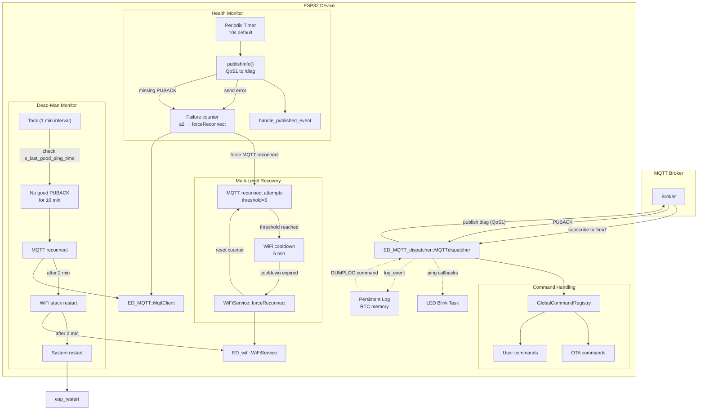

# ED_MQTT Dispatcher – Complete Documentation

The **ED_MQTT Dispatcher** is a lightweight, zero‑heap MQTT command dispatcher and health monitor for ESP‑IDF. It integrates with `ED_MQTT::MqttClient`, parses incoming messages (colon commands or JSON), routes them to registered handlers, and includes a **multi‑layer recovery system** with **compact persistent logging** (RTC memory) that survives software reboots. A built‑in `DUMPLOG` command allows remote retrieval of the event log for debugging.

## Table of Contents
- [Overview](#overview)
- [Architecture](#architecture)
- [Command Processing](#command-processing)
- [Health Monitor & Ping Callbacks](#health-monitor--ping-callbacks)
- [Multi‑Level Recovery (MQTT → WiFi)](#multi‑level-recovery-mqtt--wifi)
- [Dead‑Man Monitor & Escalation](#dead‑man-monitor--escalation)
- [Persistent Logging & DUMPLOG Command](#persistent-logging--dumplog-command)
  - [Compact Delta Log Format](#compact-delta-log-format)
  - [Event Codes](#event-codes)
  - [Retrieving the Log](#retrieving-the-log)
  - [Example Output](#example-output)
- [API Reference](#api-reference)
- [Usage Examples](#usage-examples)
- [Command Syntax](#command-syntax)
- [PFREQ Command](#pfreq-command)
- [Dependencies](#dependencies)
- [Troubleshooting](#troubleshooting)

---

## Overview

The dispatcher provides:

1. **Command dispatch** – listens on MQTT topic `"cmd"`, parses colon commands (`:COMMAND ...`) or JSON objects, and routes them to registered `iCommandRunner` subscribers or `CommandRegistry` entries.
2. **Periodic device diagnostics** – every N seconds (default 10, adjustable via `PFREQ`) publishes a JSON object to `devices/<id>/diag` containing uptime, IP, and custom fields.
3. **Health monitoring** – the diagnostic message is published with QoS 1. If two consecutive PUBACKs are missed, it forces an MQTT reconnect.
4. **Multi‑level recovery** – tracks MQTT reconnect attempts. After 6 attempts, triggers a WiFi reset (once every 5 min).
5. **Dead‑man monitor** – a separate task checks every minute for the last successful PUBACK. Escalation: 10 min → MQTT reconnect; 12 min → WiFi stack restart; 14 min → system restart. All steps are logged.
6. **Persistent logging** – a compact circular buffer in RTC memory stores key events (3 bytes per event). The log survives `esp_restart()` (but not power cycles). The `DUMPLOG` command publishes the log remotely.

All components use static allocation – no `std::function`, no dynamic memory after initialisation.

---

## Architecture


```mermaid
flowchart TD
    subgraph "MQTT Broker"
        B[Broker]
    end

    subgraph "ESP32 Device"
        MQTT[ED_MQTT::MqttClient]
        DISP[ED_MQTT_dispatcher::MQTTdispatcher]
        WIFI[ED_wifi::WiFiService]

        subgraph "Command Handling"
            REG[GlobalCommandRegistry]
            CMD1[OTA commands]
            CMD2[User commands]
        end

        subgraph "Health Monitor"
            TIMER["Periodic Timer<br>10s default"]
            PUB["publishInfo()<br>QoS1 to /diag"]
            ACK[handle_published_event]
            FAIL["Failure counter<br>≥2 → forceReconnect"]
        end

        subgraph "Multi-Level Recovery"
            COUNTER["MQTT reconnect attempts<br>threshold=6"]
            COOLDOWN["WiFi cooldown<br>5 min"]
            WIFI_RECONNECT[WiFiService::forceReconnect]
        end

        subgraph "Dead‑Man Monitor"
            DEADMAN_TASK["Task (1 min interval)"]
            TIMEOUT["No good PUBACK<br>for 10 min"]
            ESCALATE1[MQTT reconnect]
            ESCALATE2[WiFi stack restart]
            ESCALATE3[System restart]
        end

        LED[LED Blink Task]
        LOG[Persistent Log<br>RTC memory]
    end

    B -- "subscribe to 'cmd'" --> DISP
    DISP -- "publish diag (QoS1)" --> B
    B -- "PUBACK" --> DISP

    DISP --> REG
    REG --> CMD1
    REG --> CMD2

    TIMER --> PUB
    PUB --> ACK
    PUB --> |send error| FAIL
    PUB --> |missing PUBACK| FAIL
    FAIL --> |force MQTT reconnect| COUNTER
    COUNTER --> |threshold reached| COOLDOWN
    COOLDOWN --> |cooldown expired| WIFI_RECONNECT
    WIFI_RECONNECT --> WIFI
    WIFI_RECONNECT --> |reset counter| COUNTER
    FAIL --> MQTT

    DEADMAN_TASK --> |check s_last_good_ping_time| TIMEOUT
    TIMEOUT --> ESCALATE1
    ESCALATE1 --> |after 2 min| ESCALATE2
    ESCALATE2 --> |after 2 min| ESCALATE3
    ESCALATE1 --> MQTT
    ESCALATE2 --> WIFI
    ESCALATE3 --> esp_restart

    DISP -. "ping callbacks" .-> LED
    DISP -. "log_event" .-> LOG
    LOG -. "DUMPLOG command" .-> DISP
```

---

## Command Processing

The dispatcher processes messages from the MQTT topic `"cmd"` in two formats: **colon commands** (starting with `:`) and **JSON** (single object or array).

### Colon Command Flow

1. The string is parsed: the first token after `:` is the command ID (converted to uppercase). Subsequent tokens are either a default value or `-key value` flags.
2. The dispatcher looks up the command in the `GlobalCommandRegistry`. If found, it calls the registered function pointer, passing a `ctrlCommand*` that contains the parameters (including auto‑injected `_msgID`, `_original`, `_default`).
3. The command handler can then call `ackCommand()` to send an acknowledgment.

### JSON Command Flow

- Single object: `{"cmd": "FWUP", "data": "v2.1.0"}` → same as `:FWUP v2.1.0`.
- Array of objects: each object is dispatched in order.

---

## Health Monitor & Ping Callbacks

- Every `s_info_timer` period (default 10s), `publishInfo()` sends a QoS 1 message to `devices/<id>/diag`.
- It stores the message ID and sets `s_ping_pending = true`.
- If the previous ping is still pending when the timer fires again, `s_ping_fail_count` is incremented.
- After **2 consecutive missed PUBACKs** (or a publish send error), `s_ping_failure_cb` is called and `forceReconnect()` is triggered.
- When a PUBACK arrives, `handle_published_event()` clears `s_ping_pending`, resets the failure counter, updates `s_last_good_ping_time`, and calls `s_ping_success_cb`.

**Callback Registration:**

```cpp
static void on_ping_success() {
    // normal LED (green, version colour)
}
static void on_ping_failure() {
    // red LED, fast blink
}
MQTTdispatcher::registerPingSuccessCallback(on_ping_success);
MQTTdispatcher::registerPingFailureCallback(on_ping_failure);
```

---

## Multi‑Level Recovery (MQTT → WiFi)

- Each time the health monitor forces an MQTT reconnect, `s_mqtt_reconnect_attempts` is incremented.
- When this counter reaches `MQTT_RECONNECT_THRESHOLD` (default **6**), the dispatcher calls `ED_wifi::WiFiService::forceReconnect()` **only if** at least `WIFI_RECONNECT_COOLDOWN_SEC` (default 300 seconds = 5 minutes) has passed since the last WiFi reset.
- The counter resets to `0` after a WiFi reset or after a successful PUBACK / connection.
- This prevents flooding the router with WiFi reconnects when the broker alone is down.

---

## Dead‑Man Monitor & Escalation

A separate FreeRTOS task (`mqtt_deadman`) runs every **60 seconds**. It checks the time since the last good PUBACK (`s_last_good_ping_time`). If no PUBACK has been received for:

- **10 minutes** → forces an MQTT reconnect (`ED_MQTT::MqttClient::forceReconnect()`).
- **+2 more minutes (12 minutes total)** → forces a full WiFi stack restart (`ED_wifi::WiFiService::forceReconnect()`). This destroys and recreates the network interface.
- **+2 more minutes (14 minutes total)** → restarts the entire ESP (`esp_restart()`).

Each step is logged to the persistent log (and console). This guarantees the device never stays offline indefinitely.

---

## Persistent Logging & DUMPLOG Command

The dispatcher maintains a **compact circular log buffer** in RTC memory. RTC memory is **internal SRAM** that survives software reboots (e.g., `esp_restart()`) but not power cycles. This means after a deliberate system restart (last resort), you can still retrieve the events that led to the restart.

The log is enabled by default (`ED_MQTT_DISPATCHER_ENABLE_PERSISTENT_LOG` macro). To disable it, comment out the `#define` at the top of the header.

### Compact Delta Log Format

- **Buffer size**: 2046 bytes (RTC memory).
- **Entry size**: 3 bytes = 1 byte event code + 2 bytes delta (milliseconds since previous event).
- **Maximum entries**: 682 events.
- **Base timestamp**: absolute milliseconds since boot of the first logged event (stored separately).
- **Wrapping**: When the buffer is full, new events are **discarded** (no overwrite) to preserve the oldest events leading to a failure. For most failure scenarios, 682 events are sufficient.

### Event Codes

Each event is represented by a single byte code. The following codes are logged:

| Code | Event | Meaning |
|------|-------|---------|
| 1 | `IP_READY` | Wi‑Fi IP obtained, MQTT client creation starts |
| 2 | `MQTT_CONNECTED` | MQTT connection established (PUBACK possible) |
| 3 | `MQTT_DISCONNECTED` | MQTT connection lost (broker or network) |
| 4 | `INFO_PING_SENT` | Diagnostic ping successfully queued (QoS1) |
| 5 | `PUBACK_RECEIVED` | Broker acknowledged a ping (good health) |
| 6 | `MISSING_PUBACK` | Timer fired while previous ping still pending |
| 7 | `FORCE_RECONNECT` | Health monitor triggered an MQTT reconnect |
| 8 | `WIFI_RECONNECT` | Multi‑level recovery triggered a WiFi reset |
| 9 | `DEAD_MAN_MQTT` | Dead‑man: 10 min no PUBACK → MQTT reconnect |
| 10 | `DEAD_MAN_WIFI` | Dead‑man: after +2 min → WiFi stack restart |
| 11 | `DEAD_MAN_RESTART` | Dead‑man: after +2 more min → system restart |
| 12 | `PUBLISH_ERROR` | `esp_mqtt_client_publish` returned error |
| 13 | `THRESHOLD_REACHED` | MQTT reconnect attempts reached threshold (6) |
| 14 | `TOO_MANY_MISSED` | Two consecutive missed PUBACKs |
| 15 | `INFO_PING_SKIPPED` | Publish skipped because MQTT not ready |
| 16 | `RECONNECT_ATTEMPT` | MQTT reconnect attempt count incremented |

These codes allow full reconstruction of the sequence of events leading to a failure.

### Retrieving the Log

Send the command `:DUMPLOG` to the MQTT topic `"cmd"`. The dispatcher will respond by publishing the log (as plain text) to the topic:

    devices/<your_device_id>/dumplog

For example, using `mosquitto_pub`:

    mosquitto_pub -t "cmd" -m ":DUMPLOG" -h <broker_ip>

Then subscribe to the response:

    mosquitto_sub -t "devices/ESP_32:97:54/dumplog" -h <broker_ip>

The log output shows each event with a relative timestamp (seconds.milliseconds) from the first logged event.

### Example Output

    [  0.000] IP ready
    [  1.234] MQTT connected
    [ 11.456] Ping sent
    [ 11.789] PUBACK
    [ 21.456] Ping sent
    [ 31.456] Missing PUBACK
    [ 31.456] Too many missed
    [ 31.456] Force reconnect
    [ 31.456] Reconnect attempt
    [ 33.567] MQTT connected
    [ 43.567] Ping sent

If the ESP later restarts due to the dead‑man (code 11), the log will still be present in RTC memory. After reboot, you can send `:DUMPLOG` again and see the events from before the restart (the log is not cleared on software reboot). This gives you a complete breadcrumb trail.

**Note:** Power cycling the ESP (removing power) will erase the log, as RTC memory loses content. For debugging, keep the device powered.

---

## API Reference

### MQTTdispatcher

All methods are **static**.

| Method | Description |
|--------|-------------|
| `esp_err_t initialize(esp_mqtt_client_config_t* config)` | Creates timers, tasks, and the dead‑man monitor. |
| `esp_err_t run()` | Subscribes to IP‑ready event and starts MQTT client creation. |
| `void subscribe(iCommandRunner* subscriber)` | Registers a command subscriber (colon/JSON commands). |
| `void registerJsonFieldProvider(JsonFieldProvider provider)` | Adds custom fields to the diagnostic JSON. |
| `void ackCommand(int64_t msgID, const char* cmdID, ackType result, const char* original)` | Sends acknowledgment to `ack/<device_id>`. |
| `void registerPingSuccessCallback(PingSuccessCallback cb)` | Called on every successful PUBACK. |
| `void registerPingFailureCallback(PingFailureCallback cb)` | Called on missed PUBACK, send error, or disconnect. |
| `void resetMqttReconnectAttempts()` | Resets the MQTT reconnect counter. |
| `void cmd_dumplog(ctrlCommand* cmd)` | Command handler for `DUMPLOG` (built‑in). |

**Diagnostic JSON Provider:**

```cpp
using JsonFieldProvider = void (*)(ED_S_JSON::StaticJson& doc);
void wifiDiagProvider(ED_S_JSON::StaticJson& doc) {
    doc.addString("ssid", "MyNetwork");
    doc.addInt("rssi", -45);
}
MQTTdispatcher::registerJsonFieldProvider(wifiDiagProvider);
```

---

## Usage Examples

### Basic Setup

```cpp
#include "ED_MQTT_dispatcher.h"
#include "ED_wifi.h"

extern "C" void app_main() {
    ED_wifi::WiFiService::launch();
    esp_mqtt_client_config_t mqtt_cfg = {}; // fill with broker details
    ED_MQTT_dispatcher::MQTTdispatcher::initialize(&mqtt_cfg);
    ED_MQTT_dispatcher::MQTTdispatcher::run();
    // Register callbacks, providers, etc.
    while (1) vTaskDelay(pdMS_TO_TICKS(10000));
}
```

### Registering Commands

Using `CommandWithRegistry` (auto‑registers with global registry):

```cpp
class MyCommands : public ED_MQTT_dispatcher::CommandWithRegistry {
public:
    MyCommands() : CommandWithRegistry("MYREG", "My commands") {
        ED_MQTT_dispatcher::ctrlCommand cmd;
        cmd.cmdID = "BLINK";
        cmd.cmdDex = "Control LED blink";
        cmd.funcPointer = cmd_blink;
        cmd.addParam("rate_ms", "500");
        registry.registerCommand(cmd);
    }
    static void cmd_blink(ED_MQTT_dispatcher::ctrlCommand* cmd) {
        const char* rate = cmd->getParam("rate_ms");
        // ...
    }
};
static MyCommands myCommands; // auto‑registered on construction
```

### Handling Ping Events (LED feedback)

```cpp
static bool mqtt_healthy = false;

static void on_ping_success() {
    mqtt_healthy = true;
    set_led(0, 255, 0); // green
}

static void on_ping_failure() {
    mqtt_healthy = false;
    set_led(255, 0, 0); // red
}

// In app_main():
ED_MQTT_dispatcher::MQTTdispatcher::registerPingSuccessCallback(on_ping_success);
ED_MQTT_dispatcher::MQTTdispatcher::registerPingFailureCallback(on_ping_failure);
```

---

## Command Syntax

### Colon Commands

    :COMMAND_NAME [default_value] [-flag1 value1] [-flag2 value2] ...

**Examples:**

    :FWUP v2.1.0
    :PFREQ 30s
    :BLINK -rate_ms 200 -color blue
    :HELP OTA

Special auto‑injected parameters: `_msgID`, `_original`, `_default`.

### JSON Commands

**Single object:**

    {"cmd": "FWUP", "data": "v2.1.0"}

**Array of commands:**

    [
        {"cmd": "FWUP", "data": "v2.1.0"},
        {"cmd": "BLINK", "data": "-rate_ms 500"}
    ]

---

## PFREQ Command

Changes the diagnostic publish interval (and health check frequency).

    :PFREQ 30s      # 30 seconds
    :PFREQ 2m       # 2 minutes
    :PFREQ 1h       # 1 hour
    :PFREQ 0        # disable
    :PFREQ D        # disable

---

## Dependencies

- **ED_MQTT** – MQTT client wrapper.
- **ED_S_JSON** – Static JSON builder.
- **ED_sys** – Device name, uptime.
- **ED_wifi** – For `forceReconnect()` (optional).

**CMakeLists.txt:**

```cmake
idf_component_register(SRCS "ED_MQTT_dispatcher.cpp"
                       INCLUDE_DIRS "."
                       REQUIRES mqtt ED_MQTT ED_S_JSON ED_sys ED_wifi)
```

---

## Troubleshooting

| Symptom | Likely cause | Action |
|---------|--------------|--------|
| LED stays red after broker restart | Missing PUBACK (reason code 16) | Check broker ACL and MQTT5 user properties. |
| No pings sent | Info timer not started | Ensure `on_mqtt_connected` was called (check log). |
| Dead‑man restarts system repeatedly | WiFi stack cannot connect | Check WiFi credentials, signal strength, DHCP. |
| `DUMPLOG` returns nothing | Log buffer empty or MQTT down | Wait for at least one event, or read console on reboot. |
| Log shows only a few events | Buffer may be full | Events after buffer full are dropped; increase buffer size if needed. |

---

## Summary

The dispatcher combines three independent recovery layers (fast MQTT reconnect, slower WiFi reset, dead‑man escalation) with a **compact persistent log** (RTC memory) that survives software reboots. The `DUMPLOG` command lets you retrieve the log remotely, providing full visibility into the sequence of events leading to a failure. This makes the device truly self‑healing and debuggable without physical access.
```