# MQTT communication with ESP -concept

## Communication with ESP

### topic: cmd

<details>
  <summary>Click to expand section</summary>


Sends a command to the ESP for execution. This should also include command to request as a feedback the list of implemented commands (help-like).

Command is defined as any action aimed at modifying the behaviour of the ESP in its control of peripherals.

Change of logging level, logging details activation/deactivation needs to be handled in the info channel instead

#### Command transfer format

Commands can be sent in two different formats
- **plain string** followed by parameter, the command is a short identifier starting with :, example

```:SDPI 120```  i.e. for instance setd data polling interval to 120 secoonds

This format is meant to be used sending manual messages through Mosquitto (TODO-> using telnet too?).
- JSON string in array.
In case of sequence of commands or simple command sent via code, the Json format is preferred. The command will be a Json inside a Json array, such as

```[{"cmd":"SDPI","data":120},{...}]```


  </details>

### topic: data

```mermaid
sequenceDiagram
%%autonumber
    participant E as ESP32_XX_XX_XX
    participant M as 🧭 MQTT Broker
    actor C as user
    E-->>M: subscribes /cmd
loop periodic ping/data
    E-->>M: publish /info/
    E-->>M: deliver /data//ESP32_XX_XX_XX
    end
    C-->>+E: publishes /cmd/ESP32_XX_XX_XX
    E-->>-C: deliver ack /cmd/ESP32_XX_XX_XX
    opt tuned is data
    E-->>M: deliver /data//ESP32_XX_XX_XX
    end
```

<details>
  <summary>Click to expand section</summary>


flow of data will be controlled with commands sent over the cmd or cmd/device topic

cmd/device will target a specific device, cmd will target all the devices and filtered, pre execution, based on filtering mehotds
//TODO define filtering method: at MQTT level or on ESP level?

### topic: info

```mermaid
sequenceDiagram
%%autonumber
    participant E as ESP32_XX_XX_XX
    participant M as 🧭 MQTT Broker
    actor C as user
    E-->>M: subscribes /info
loop periodic ping
    E-->>M: publish /info/
    end
    C-->>+E: publishes /info/ESP32_XX_XX_XX
    E-->>-C: deliver ack /info/ESP32_XX_XX_XX
    E-->>M: deliver newformat /info/ESP32_XX_XX_XX
```

<details>
  <summary>Click to expand section</summary>


- ESP to MQTT:
  - periodic status info ("ping") which are usually not fully stored (unless the server interface is requred to do so).
  such data are published on the generic *info* channel to allow for a generic monitoring of the system without the need to know the specific device handle.
### topic: DAT
sends data packets which need to be processed for storage in database
- Mqtt to ESP: none. request to start/stop a flow should come through command

  </details>


## implementation

using a